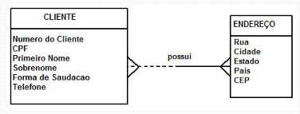
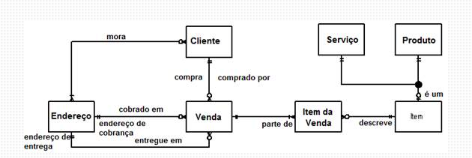
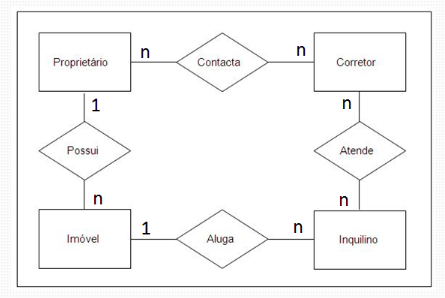
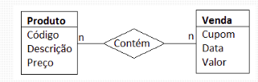
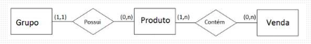

# MODELAGEM DE DADOS

## SUMÁRIO

1. <a href="#conceitos-modelagem">Conceitos Inicias de Modelagem de Dados</a>
2. <a href="#introducao-modelagem-dados">Modelagem de Dados: Introdução</a>

# 
Conceitos Inicias de Modelagem de Dados

**Estilos Básicos de Modelos de Dados**:
- Conceituais: usados para explorar conceitos do domínio com os envolvidos no projeto.
- Lógicos (MLDs): usados para explorar os conceitos do domínio e seus relacionados.
- Físicos (MFDs): descreve as tabelas de dados, colunas e relacionamentos entre as tabelas.
    - devem refletir os padrões de nomenclaturas.
    - indica os tipos de dados da coluna.

_Nota: ORMs são usados para explorar o domínio da aplicação com os envolvidos no projeto._

|Notações de Modelagem|
|---------------------|
|`EL` - modelagem de dados de negócio e lógica de alto nível|
| `Barker` - abrangente para todos os tipos de modelos de dados |
| `IDEF1X` - intencionada para modelagem física |
| `UML` - notação de modelagem não oficial |

**Etapas da Modelagem de Dados**:
1. Identificar os tipos de entidades.
    - descreve de forma coesa uma informação do mundo real.
    - Exemplo: entidade pessoa, localidade, profissão. 
2. Identificar atributos.
3. Aplicar convenções de nomes.
4. Identificar relacionamentos.
5. Associar chaves.
6. Normalizar para reduzir a redundância dos dados.
7. Diversificar para melhorar o desempenho.

## MER e DER: Modelagem de Banco de Dados

**Modelo Entidade Relacionamento (MER)** - descreve os objetos (entidades) envolvidas em um domínio de negócio, com suas características (atributos) e como elas se relacionam entre si (relacionamentos).

**Classificação de Entidades**:
1. Fortes - independe de outras entidades.
2. Fracas - dependem de outros entidades para existir.
3. Associativas - surge quando há necessidade de associar uma entidade a um relacionamento existente.

**Relacionamentos**:
1. `1..1` - Cada uma das entidades envolvidas referenciam apenas uma unidade da outra.
2. `1..n` - Uma das entidades envolvidas pode referenciar várias unidades de outras, porém do outro lado, uma unidade só referencia uma outra entidade.
3. `n..n` - cada entidade de ambos os lados podem referenciar várias unidades.

**Atributos**: características que descrevem cada entidade dentro do domínio.
1. Descritivos - característica intrínseca de uma entidade.
2. Nominativos - define e identifica o objeto.
3. Referenciais (**Chave Estrangeira**) - ligação de entidade com outra.

Estrutura de um atributo - simples (único atributo define as caracteristicas da entidade); e composto (mais de um atributo para definir as informações)

No diagrama entidade relacionamento, as `entidades` são representadas por retângulos, os `atributos` por elipses e os `relacionamentos` por losangos, ligados a entidades por linhas, contendo a sua cardinalidade

|**Formas de Representação**|
|-----------------------|

---

2. 
Modelagem de Dados: Introdução

