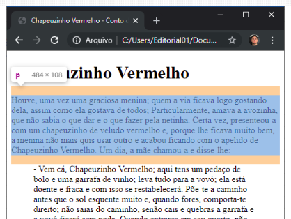

# FUNDAMENTOS DE CSS

# SUMÁRIO

1. <a href="#conceitos-css">Conceitos iniciais de CSS</a>

---

# <p id="conceitos-css">Conceitos iniciais de CSS</p>

No CSS declaramos o estilo através de regras, que normalmente é composta de
um seletor e uma ou mais declarações entre chaves.

Exemplo:
```bash
h1 {
  background: #fdfdfd;
}
```

tag link - utilizada no html para permite a estilização do documento com css.
- `<link rel="stylesheet" type="text/css" href="<local_estilo_css>" />`

Propriedades:
1. **color** - muda a cor de um texto.
2. **font-size** - muda o tamanho (fonte) de um parágrafo ou texto.

## BOX MODEL

Caixas que envolvem os elementos que possuem margem, borda, preenchimento e conteúdo.

