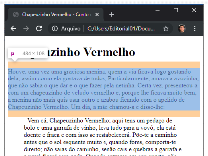
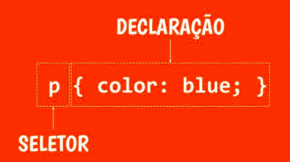

# FUNDAMENTOS DE CSS

# SUMÁRIO

1. <a href="#conceitos-css">Introdução: Conceitos iniciais de CSS</a>
2. <a href="#seletores-css">Introdução: seletores CSS</a>

---

# <p id="conceitos-css">Introdução: Conceitos iniciais de CSS</p>

No CSS declaramos o estilo através de regras, que normalmente é composta de
um seletor e uma ou mais declarações entre chaves.

Exemplo:
```bash
h1 {
  background: #fdfdfd;
}
```

tag link - utilizada no html para permite a estilização do documento com css.
- `<link rel="stylesheet" type="text/css" href="<local_estilo_css>" />`

Propriedades:
1. **color** - muda a cor de um texto.
2. **font-size** - muda o tamanho (fonte) de um parágrafo ou texto.

## BOX MODEL

Caixas que envolvem os elementos que possuem margem, borda, preenchimento e conteúdo.



## SINTAXE DE UMA REGRA

Composição de uma regra:
- seletor: informa em qual elemento(s) regra deve ser aplicada.
- declaração: informar como os elementos indicados pelo seletor devem ser modificados.

```bash
# REGRA

# --> p é o seletor da regra
# --> tudo que este entre as chaves são as declarações
p {
  font-family: Arial;
}

h1, h1 {
# informa a fonte do texto
  font-family: Arial;
# informa a cor do texto
  color: yellow;
}
```

_Nota: os cores também podem ser repassadas utilizando os números hexadecimais._

---

# <p id="seletores-css">Introdução: seletores CSS</p>



As regras podem ser compostas por um ou mais elementos que receberão as propriedades definidas.

**Seleção por elemento** - especifica o elemento html, ou seja, declaramos apenas a tag que queremos estilizar.

```bash
p {
  color: blue;
}

# Todos os elementos do mesmo tipo terão sua cor alterada para azul
```

**Seleção por classe** - https://www.devmedia.com.br/css-seletores/40729