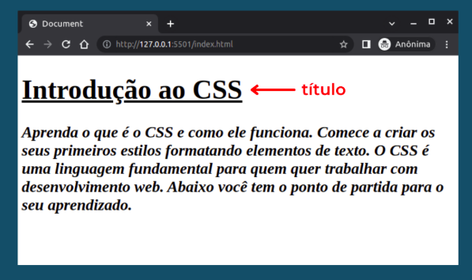
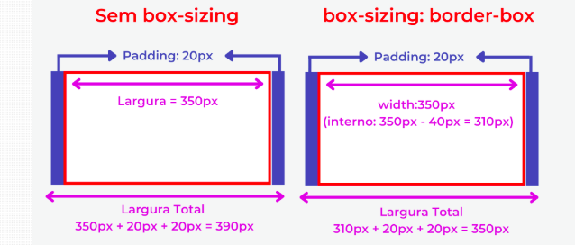

# FUNDAMENTOS DE CSS

# SUMÁRIO

1. <a href="#conceitos-css">Introdução: Conceitos iniciais de CSS</a>
2. <a href="#seletores-css">Introdução: seletores CSS</a>
3. <a href="#estilo-texto-css">Introdução: Aplicando estilos a elementos de texto</a>
4. <a href="#propriedades-css">Introdução: Propriedades</a>
5. <a href="#seletores-css">Introdução: Seletores</a>
6. <a href="#background">Background: Preenchendo o fundo de um elemento</a>
7. <a href="#box-model-modificando-elementos">Box Model: Modificando elementos HTML</a>
8. <a href="#posicionamento-fixed">Posicionamento: Position Fixed</a>
9. <a href="#posicionamento-relative-absolute">Posicionamento: Position Relative e Absolute</a>
10. <a href="#flexbox">Flexbox</a>
11. <a href="#pseudo-classes-elementos">Estilizando páginas com pseudo-classes e pseudo-elementos</a>
12. <a href="#design-responsivo">Design Responsivo</a>

---

# <p id="conceitos-css">Introdução: Conceitos iniciais de CSS</p>

No CSS declaramos o estilo através de regras, que normalmente é composta de
um seletor e uma ou mais declarações entre chaves.

Exemplo:
```css
h1 {
  background: #fdfdfd;
}
```

tag link - utilizada no html para permite a estilização do documento com css.
- `<link rel="stylesheet" type="text/css" href="<local_estilo_css>" />`

Propriedades:
1. **color** - muda a cor de um texto.
2. **font-size** - muda o tamanho (fonte) de um parágrafo ou texto.

## BOX MODEL

Caixas que envolvem os elementos que possuem margem, borda, preenchimento e conteúdo.


## SINTAXE DE UMA REGRA

Composição de uma regra:
- seletor: informa em qual elemento(s) regra deve ser aplicada.
- declaração: informar como os elementos indicados pelo seletor devem ser modificados.

```css
# REGRA

# --> p é o seletor da regra
# --> tudo que este entre as chaves são as declarações
p {
  font-family: Arial;
}

h1, h1 {
# informa a fonte do texto
  font-family: Arial;
# informa a cor do texto
  color: yellow;
}
```

_Nota: os cores também podem ser repassadas utilizando os números hexadecimais._

---

# <p id="seletores-css">Introdução: seletores CSS</p>


As regras podem ser compostas por um ou mais elementos que receberão as propriedades definidas.

**Seleção por elemento** - especifica o elemento html, ou seja, declaramos apenas a tag que queremos estilizar.

```css
p {
  color: blue;
}

/* Todos os elementos do mesmo tipo terão sua cor alterada para azul */
```

**Seleção por classe** - seleção do elemento por meio do nome da classe que foi definida como atributo.
- somente elementos que possuem o nome da classe sofrerão as modificações.

```css
/* index.html */
<elemento classe="nome_classe"> ... </elemento>

/* style.css */
.nome_classe { 
# define a cor de fundo do elemento
  background: blue
}
```

**Seleção por id** - seleção do elemento pelo id que foi definido como atributo.

```css
/* index.html */
<elemento id="nome_id" classe="nome_classe"> ... </elemento>

/* style.css */
#nome_id{
/* define o preenchimento */
  padding: 5px
}

.nome_classe { 
# define a cor de fundo do elemento
  background: blue
}
```

> OBS: UM ID SÕ PODE PERTENCER A UM ÚNICO ELEMENTO.

## Agrupamentos

**Por Elemento** - insere mais de um elemento em uma regra de estilo para que as alterações sejam iguais para ambos.

```css
h1, p {
  color: blue;
}
```

**Por descendência de elementos** - composto pelo elemento pai e seu elemento filho o qual desejamos selecionar.

```css
div p {
  color: blue;
}
```

**Por Classe** - seleção feita por elementos que possuem duas classes.

```css
.nome_classe1.nome_classe2 {
  color: blue;
}
```

**Por descendência de classe** - seleção realizada por meio de uma classe pai e sua classe filha a qual desejamos selecionar.
- possui a mesma ideia de descendência de elementos.

```css
.nome_classe_pai .nome_classe_filha {
  color: blue;
}
```

---

<p id="estilo-texto-css">Introdução: Aplicando estilos a elementos de texto</p>

**Negrito** - a propriedade `font-weight` é utilizada para aplicar ou remover negrito de um elemento de texto.
- O valor da propriedade pode ser numérico ou por uma palavra.

_Nota: os valores numéricos vão de 100 até 900, tendo um acrescimo de 100 em cada um (Ex: 100, 200, 300, ..., 900)._

```css
p {
  font-weight: 400; /* Corresponde a aparência padrão da maioria das fontes */
}
```

_Nota: os valores mais utilizados são de 400 e 700, sendo o primeiro a fonte padrão e o segundo o negrito._

**Itálico** - estilo obtido utilizando a propriedade `font-style` com o valor italic.

```css
p {
  font-style: italic;
}
```

**Cor** - a cor do texto pode ser aplicada utilizando a propriedade `color`, que recebe tanto valores textuais quanto valores numéricos.
- Valores numéricos: hexadecimais (Ex: `#fdfdfd`).
- Valores textuais: black ou white.

```css
p {
  /* AMBOS REPRESENTAM A MESMA COR */
  /* color: red; */
  color: #ff0000;
}
```

Funções de Cor:
1. RGB - utiliza as cores vermelha, verde e azul para gerar uma cor.
  - `rgb( red, green, blue )` - recebe como parâmetro 3 valores que podem variar de 0 a 255.
2. RGBA - possui as mesmas capacidades da função RGB, porém possui um quarto parâmetro chamado alpha (Varição de 0.0 a 1.0), que determina a opacidade da cor.
3. HSL.

Exemplo: aplicando as funções.
```css
/* RGB */
p {
  color: rgb(81, 155, 0);
}

/* RGBA */
p {
  color: rgba(81, 155, 0, 0.5);
}
```

**Tamanho da Fonte** - a propriedade `font-size` pode ser utilizada para modificar o tamanho da fonte, recebendo palavras-chaves ou numéros.
- Palavras-chaves: xx-small, x-small, small, smaller, medium, larger, large, x-large, xx-large (Vai do menor ou maior).
- Para valores numéricos é importante informar em que unidade css o elemento se encontra.

```css
p {
  font-size: 22px;
}
```

**Fonte** - a propriedade `font-family` pode ser utilizada para customizar a fonte utilizada em um texto.

```css
p {
  font-family: "Arial Black", Gadget, sans-serif;
}
```

_Nota: nomes com várias palavras devem está sempre entre aspas._

**Alinhamento** - para alinhar um texto, pode-se utilizar a propriedade text-align.

Formas de alinhamento:
1. `right`.
2. `left`.
3. `center`.
4. `justify`.

```css
p {
  text-align: center;
}
```

**Propriedade `text-decoration`** - responsável por aplicar linhas em um texto.

```css
h1 {
  font-size: 48px;
  font-family: Verdana;
  text-decoration: underline;
}
```


_Nota: essa propriedade é muito utilizado para remover o sublinhado dos links que vem por padrão._

**Altura de linhas dos texto** - a propriedade `line-height` pode ser utilizada para adicionar o espaçamento entre as linhas.

```css
p {
  line-height: 48px;
}
```

---

# <p id="propriedades-css">Introdução: Propriedades</p>

sintaxe:

```css
elemento {
  propriedade: valor;
}
```

As propriedades representam características dos elementos das páginas web.

**COR** - propriedades usadas para alterar a cor `color` (altera a cor do texto) e `background-color` (altera o fundo do elemento).

_Nota: **tag body** contém todos os elementos que são visíveis na tela._

```css
/* DEFINE A COR DE FUNDO PRINCIPAL DO SITE */
body {
  background-color: #000000;
}

p {
  color: blue;
}
```

**FONTE** - propriedade usadas para alterar a fonte `font-size` (altera o tamanho da fonte), `font-weight` (altera a espessura da fonte) e `font-family` (altera o estilo da fonte).

Fontes Padrões mais Utilizadas:


```css
h1 {
  font-size: 45px;
  font-family: Verdana;
  font-weight: bold;
}
```

Propriedade `text-decoration` - propriedade utilizada para aplicar linhas no texto.

Exemplo:




_Nota: esta propriedade é muito utilizada para remover o sublinhado dos links._

Propriedade `text-align` - propriedade responsável por alinhas os textos.


Propriedade `line-height` - define a altura das linhas dos textos.

```css
p {
  font-size: 24px;
  line-height: 48px;
}
```


_Nota: se um estilo de fonte for aplicado em uma div, todos os elementos serão afetados._

**ALTURA E LARGURA** - propriedades que definem a área que um elemento ocupa na tela, `height` e `width`.

```css
div {
/* define a altura do elemento */
  height: 100px;
/* define a largura do elemento */
  width: 400px;
}
```

**Margem** - representa a distância entre os elementos de uma página.

```css
h1 {
  font-size: 20px;
  font-family: Verdana;
  text-align: center;
  margin: 60px; /* REPRESENTA A DISTÂNCIA PARA TODOS OS LADOS DO ELEMENTO */
}
```


Outras propriedades de margem:
1. `margin-top` - aplica margem na parte superior.
2. `margin-bottom` - aplica margem na parte inferior.
3. `margin-right` - aplica margem na parte direita.
4. `margin-left` - aplica margem na parte esquerda.


Exemplo: definindo margem com a forma compacta.
```css
div {
  margin: 70px  20px   10px    60px
  /*      Top   Right  Bottom  Left*/
}

div {
  margin:     10px             20px
  /*      Top e Bottom    left e Right*/
}
```

Exemplo: forma de centralizar um elemento na tela.
```css
div {
  margin: 10px auto /* auto: margem se ajustam de acordo com os valores da tala */
}
```

_Nota: é sempre mais indicado utilzar a propriedade margin, do que especificar cada umas das margens._

**Borda** - representam as linhas que cortonam os elementos.

Propriedades de borda:
1. `border-width` - largura da borda.
2. `border-style` - estilo da borda.
3. `border-color` - cor da borda.

```css
div {
  width: 600px;
  border-width: 2px;
  border-style: solid;
  border-style: #454545;
}

/* FORMA RESUMIDA */

span {
  border: 2px dashed #ff0000;
}
```

Propriedades para adicionar borda em lados específicos dos elementos:
1. `border-top` - aplica borda na parte superior.
2. `border-bottom` - aplica borda na parte inferior.
3. `border-left` - aplica borda na parte lateral esquerda.
4. `border-right` - aplica borda na parte lateral direita.


**Espaçamento interno** - propriedade `padding` pode ser utilizado para criar espaçamento interno nos elementos.

```css
a {
  border: 2px solid black;
  padding: 10px;
}
```


Propriedades de espaçamento mais específicas:
1. `padding-top` - espaçamento superior.
2. `padding-bottom` - espaçamento inferior.
3. `padding-left` - espaçamento na lateral esquerda.
4. `padding-right` - espaçamento na lateral direita.


Exemplo: forma compacta.
- Possui a mesma ideia de margin.

```css
div {
  padding: 10px  15px    10px   15px;
  /*       Top   Right  Bottom  Left*/
}
```

**Arredondamento de bordas**

Propriedade `border-radius` - server para arredondar os cantos de bordas de um elemento.

```css
div {
  width: 200px;
  padding: 5px;
  border: 8px solid #000000;
  border-radius: 15px;
}
```

Exemplo: arredondando as bordas com elementos diferente.

```css
div {
  border-radius:  80px   30px   70px   50px;
  /*              Top   Right  Bottom  Left*/
}
```

**União de Estilos**

Estilização de mais de um elemento com o mesmo código.

```css
span, li {
  font-size: 24px;
  font-family: Verdana;
  color: #2255ee;
}
```

---

# <p href="#seletores-css">Introdução: Seletores</p>

Os seletores servem para criar uma estilização única para o elemento.
- identificadores de elementos.

```html
<!-- Seletor de classe em um elemento -->
<span class="text-destaque"> ... </span>

<!-- Elemento com mais de um seletor -->
<span class="text-destaque text-green"> ... </span>
```

```css
.text-destaque {
  color: #ff2200;
}
```

**Descendência de elementos** - aplica um estilo em um elemento filho.
- o processo aplicado a baixo também serve para seletores de classe e por id.
```css
div p {
  font-weight: bold;
  color: red;
}
```

---

# <p id="background">Background: Preenchendo o fundo de um elemento</p>

```css
div {
  /* adiciona uma imagem de fundo */
  background-image: url('./caminho');

  /* usado para informar como a imagem irá se repetir dentro do elemento */
  background-repeat: no-repeat;


  background-position: 10px;
  background-size: 100px;
  background-attachment: fixed;
}
```

_Nota: A propriedade `background-image` é comumente utilizada em divs, body e tags semânticas._

Valores para `background-repeat`:
1. `no-repeat` - não repete imagem.
2. `repeat-y` - imagem se repete na vertical.
3. `repeat-x` - imagem se repete na horizontal.


_Nota: podemos utilizar `background-color` para preencher os espaços que a imagem não se repete._

```css
body {
  background-image: url('caminho');
  background-color: #fdfdfd;
}
```

`background-position` utilizada para alterar a posição de imagem (valores: center, right, left, top e bottom).

```css
body {
  background-position: url('caminho');
  background-position: center;
}
```

`background-size` utilizada para ajustar o tamanho da imagem de fundo.

Valores para propriedade acima:
1. `cover` - imagem ocupa todo os espaço do elemento.
2. `contain` - estica a imagem sem perder a proporção.
3. `initial` - define a propriedade para o valor padrão.
4. `inherit` - herda as propriedades do elemento pai.

_Nota: a também a possibilidade de inserir valores para definir a porcentagem da tamanho do elemento._
```css

div {
  /*             largura  altura*/
  background-size: 50%      70%;
}
```

`background-attachment` permite deixar a imagem estática.

```css
div {
  background-attachment: fixed;
}
```

Exemplo: forma resumida das propriedades de background.

```css
body {
  background:    #0f0   url('caminho')  no-repeat    top right      fixed;
            /* bk-color  bk-image       bk-repeat  bk-position  bk-attachment*/
}
```

---

# <p id="box-model-modificando-elementos">Box Model: Modificando elementos HTML</p>

**Valores relativos** - o elemento irá se adaptar de acordo com o tela do usuário.
- valor definido com base em outro elemento.

```css
div {
  width: 70%;
}
```

_Nota: o valor percentual aplicado a um elemento é relativo ao tamanho do seu elemento pai._

```css
/* Se refere a largura da tela */
/* --> 1 vw = 1% da largura da tela */
section {
  width: 1vw;
}

/* Se refere a altura da tela */
section {
  width: 1vh;
}
```

`calc` - permite realizar calculos com valores relativos em css.

```css
img {
  width: calc(100vw - 60px);
  margin: 30px;
}
```

## Definindo o tamanho dos elementos

**Propriedades**:
- `min-width` - define a largura mínima.
- `max-width` - define a largura máxima.
- `min-height` - define a altura mínima.
- `max-height` - define a altura máxima.

_Nota: as propriedades acima sempre irão se sobrepor a propriedade `width` ou `height`._

```css
img {
  width: 100%;
  min-width: 1200px;
  min-height: 1350px;
}
```

## Overflow

Garante que o conteúdo respeite as dimensões do elemento.

```css
.area {
  width: calc(100% - 110px);
  height: calc(50vh - 70px);
  padding: 15px 20px;
  margin: 0px 35px 20px 35px;
  overflow: scroll; /* valores: scroll, auto. */
}
```

**Propriedades**:
- `overflow-x`: somente horizontal.
- `overflow-y`: somente vertical.

```css
div {
  /* forma simplificada de overflow-x e overflow-y */
  overflow: auto scroll;
}
```

## Exibindo e Ocultando Elementos

Todo elemento possui por padrão o tipo de exibição `block` ou `inline`.
- **elemento `block`**: criado sempre após o elemento anterior, e ocupam toda largura disponível.
- **elemento `inline`**: criado um ao lado do outro, e ocupam apenas a largura necessário para exibir o conteúdo.

_Nota: as propriedade acima podem ser modificadas utilizando a propriedade `display`._

```css
.perfil p {
  display: inline;
}
```

**Propriedade `display`** - modifica o modo de exibição de um elemento.
- alguns valores: `inline`, `block` e `none`.

**Propriedade `visibility`** - controla a visibilidade de um elemento na tela.
- alguns valores: `visible` e `hidden`.

> OBS: VISIBILITY NÃO REMOVE O ESPAÇO DO ELEMENTO NA TELA.

```css
div {
  visibility: hidden;
}
```

**Propriedade `opacity`** - define a opacidade de um elemento na tela.

```css
img {
  width: calc(100% - 24px);
  padding: 12px;
  opacity: 50%;
}
```

## Box-Sizing

Propriedade que altera a forma como o tamanho de um elemento é calculado.

```css
/* Considera o padding e border na largura total dos elementos */
* {
  box-sizing: border-box;
}
```



## Box-Shadow

```css
img {
  width: 250px;
  height: 250px;
  box-shadow:  20px     0      10px      30px    blue;
          /* desl-x  desl-y  desfoque  expansão  cor*/
}
```


Valor `inset` - cria uma sombra na frente do elemento.

```css
img {
  box-shadow: 20px 0 10px 30px blue inset;
}
```

> OBS: O VALOR ACIMA NÃO FUNCIONA COM IMAGENS.

---

# <p id="posicionamento-fixed">Posicionamento: Position Fixed</p>

_Nota: os elementos podem ficam fixos na página mesmo após o scroll._

```css
div {
  /* FIXAR UM ELEMENTO NA TELA */
  position: fixed;
  right: 100px;
}
```

**Propriedades para mover o elemento**:
- `top`.
- `bottom`.
- `left`.
- `right`.

---

# <p id="posicionamento-relative-absolute">Posicionamento: Position Relative e Absolute</p>

```css
h2 {
  /* PERMITE MOVER O ELEMENTO LIVREMENTE NA PÁGINA */
  position: absolute;
}
```

_Nota: diferentemente de fixed, o elemento com a propriedade absolute não ficará fixo na tela quando rolar o scroll._

> OBS: AS PROPRIEDADES `top`, `bottom`, `left` e `right` SÃO ÚTEIS SOMENTE COM POSITION.

```css
h2 {
  /* PERMITE MOVER O ELEMENTO LIVREMENTE NA PÁGINA */
  /* PORÉM O ELEMENTO NÃO IRÁ SAIR DO FLUXO PADRÃO DO HTML */
  position: relative;
}
```

A propriedade `position: absolute` considera as bordas da página como referência.

_Nota: definir relative no elemento pai, fará com que o elemento filho definido com absolute considere seu elemento pai como referência._

---

# <p id="flexbox">Flexbox</p>

Principal forma de posicionar elementos com CSS.

_Nota: container que possui informações._

```css
.container {
  width: 100%;
  display: flex;
  
  /* Gera um espaçamento entre os elementos */
  justify-content: space-around;

  /* posicionamente será ajustado conforme a largura da tela */
  flex-wrap: wrap;
}
```

Ao aplicar a propriedade `display: flex` os elementos serão posicionados lado a lado devido a propriedade padrão `flex-direction: row`.

**Propriedade `flex-direction`** - indica a direção que os elementos são alinhados.
- valores: `column`, `row-reverse` e `column-reverse`

## Flex-warap e Flex-flow

**Propriedade `Flex-wrap`** - indica se os elementos devem quebrar a linha para se ajustarem a tela.

Propriedade Flex-flow - abreviação de `flex-direction` e `flex-wrap`.

```css
.container {
  width: 100%;
  display: flex;
  flex-flow:    row            nowrap;
        /* flex-direction    flex-wrap */
}
```

## Justify-Content

Gera um espaçamento entre os elementos de um container e definir seus posicionamentos.

_Nota: valor padrão `flex-start`._

Valores para a propriedade:
- `flex-end`: alinhamento a direita.
- `center`: centraliza.
- `space-between`: distribui os elementos no container.
- `space-around`: distribui os elementos no container adicionando margem.
- `space-evenly`: distribui os elementso com espaçamentos igual.

_Nota: os alinhamentos acima podem ser aplicados em colunas, basta utilizar `flex-direction: column`._

```css
.container {
  display: flex;
  justify-content: space-around;
}

.card {
  display: flex;
  flex-direction: column;
  justify-content: space-around;
}
```

## Align-items

Valores para a propriedade:
- `center`: centralizar.
- `flex-start`: posiciona no topo do container.
- `flex-end`: posiciona no fundo do container.
- `stretch`: os cards irão ocupar toda altura disponível do container.

## Propriedades dos elementos filhos

São elas:
1. `flex-grow` - indica como o elemento filho ocupará o espaço disponível, conforme a largura do container pai.
  - necessário que o container pai esteja com `display: flex`.
  - evita os **"buracos"** no container.

```css
.card {
  width: 250px;

  /* --> valor 1: indica que a taxa de crescimento será padrão */
  /* --> valor 0: indica nenhum crescimento */
  /* valores 2 e 3 podem ser aplicados para os cards ficarem maiores que outros */
  flex-glow: 1
}
```

2. `flex-shrink` - indica como um elemento filho terá seu tamanho reduzido para continuar a caber em um container.

```css
.card {
  width: 200px;
  height: 200px;

  /* --> valor 1: indica uma redução de tamanho proporcional. */
  /* valores 2 e 3 podem ser aplicados para os cards ficarem menores que outros */
  flex-shrink: 1;
}
```

3. `flex-basis` - indica uma largura ou uma altura inicial para um elemento filho, conforme o alinhamento do container.

_Nota: para definir a altura o container precisa está com `flex-direction: column` ativado._

```css
.card {
  height: 200px;
  padding: 10px 20px;
  flex-basis: 200px;
}
```

4. `flex` - abreviação de todas as propriedades acima.

```css
.card {
  flex: flex-grow  flex-shrink  flex-basis
        /* 1            1          200px */
}
```

---

# <p id="pseudo-classes-elementos">Estilizando páginas com pseudo-classes e pseudo-elementos</p>

**pseudo-classe** - palavra adicionada junto ao seletor para definir como ele será estilizado.
- alguns tipos de pseudo-classes: estado - estiliza elemento em um estado específico; ou estruturais - trabalham com a posição dos elementos.

**pseudo-elementos** - palavra adicionada junto ao seletor para definir parte do elemento que será estilizada.

## Pseudo-classes de Estado

`hover` - ativa um estilo quando o mouse passa pelo elemento.

```css
a:hover {
  background: #2b077a;
  color: white;
}
```

`visited` - altera o estilo de um link já acessado.

```css
a:visited {
  color: red;
}
```

## Pseudo-classes Estruturais

`last-of-type` - aplica um estilo apenas no último elemento.

```css
p:last-of-type {
  background-color: #6363c5;
  padding: 10px;
  box-sizing: border-box;
}

p:nth-of-type(2) {
  color: red;
}
```

Tipos de **`of-type`**:
1. `first`.
2. `last`.
3. `nth` - estiliza um elemento na posição indicada.
    - outros valores aceitos: `odd` - aplica o estilo a todos os elementos ímpares; e `even` - estiliza os elementos pares.

_Nota: of-type se refere ao elemento pai._

Tipos de **`child`**:
1. `first-child` - aplica o estilo ao primeiro filho de um elemento.
2. `last-child` - aplica o estilo ao último filho de um elemento.
3. `nth-child` - aplica o estilo a uma posição específica de um filho de um elemento.

```css
p:first-child {
  color: red;
}
```

_Nota: da mesma forma que of-type, child também aceita os parâmetros odd e even para indicar valores ímpares e pares._

`first-letter` - utilizado para estilizar a primeira letra de um texto.

```css
article::first-letter {
  font-size: 32px;
}
```

`first-line` - utilizado para estilizar a primeira linha de um elemento.

```css
article::first-letter {
  font-size: 32px;
}
```

`before/after` - adiciona um conteúdo novo antes/depois do conteúdo do elemento selecionado.

```css
a::before {
  content: "link";
}
```

> OBS: A PROPRIEDADE CONTENT É OBRIGATÓRIA QUANDO SE UTILIZA BEFORE.

_Nota: por padrão `before` e `after` possui **display inline**, para exibir imagens será necessário modificar o display._

---

# <p id="design-responsivo">Design Responsivo</p>

Termo **Viewport** - área disponível para exibição de conteúdo que cada dispositivo possui.

```html
<!-- DEFINE QUE A LARGURA DO VIEWPORT SERÁ A MESMA DO DISPOSITIVO -->
<!-- E A ESCALA INICIAL SERÁ 1 -->
<meta name="viewport" content="width=device-width, initial-scale=1.0">
```

**Media Type**: designa as regras CSS serão interpretadas por um determinado dispositivo.

Tipos de Media Type:
1. `all` - todos os dispositivos.
2. `braille` - dispositivos táteis.
3. `embossed` - disp. que impremem em braille.
4. `handheld` - disp. de mão.
5. `print` - disp. de impressão.
6. `projection` - apresentação do tipo slides.
7. `screen` - monitores ou disp. de telas coloridas.
8. `speech` - sintetizadores de voz ou leitores de tela.
9. `TTY` - terminais, teletypes e dispositivos portáteis.
10. `TV.` - televisores ou disp. de baixa resolução.

```html
<link rel="stylesheet" href="arquivo.css" type="text/css" media="print" >
```

```css
@media screen {

  body {

    background-color: #f00;

  }

}
```

> OBS: A FUNCIONALIDADE ACIMA SE TORNOU OBSOLETA, SOMENTE SENDO UTILIZADA COM `SCREEN` E `PRINT`.

**Media query**: forma base de todo layout responsivo.


Operadores para combinar Media Types com Media Features:
- `not` - utilizado quando o resultado desejado seja oposto ao real.
- `only` - previne que navegadores antigos tentem processar expressões.
- `and` - utilizado com expressões múltiplas.
- `","` - utilizado para juntar duas ou mais expressões diferentes.

```css
@media not print and  (min-width: 768px) {

  body {

    background-color: #ff0000;

  }

}

/* Only - faz com que nem todos os dispositivos executem a expressão */

@media only screen and (max-width: 320px) {

  h1 {

    text-decoration: underline;

  }

}
```

**BREAKPOINTS** - delimitadores de regras CSS para atenderem diferentes especificações, criadas pelo uso de media queries.
- Blocos previamente definidos.

## Media Queries

```css
/* # SINTAXE # */
@media [not|only] [media type] and ([query]) {
  estilos
}
```

_Nota: operadores not e only, permitem negar um tipo de mídia, ou especificar que apenas determinado tipo seja atendido, respectivamente._

## Desenvolvimento Responsivo: como resetar os estilos com CSS

