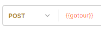
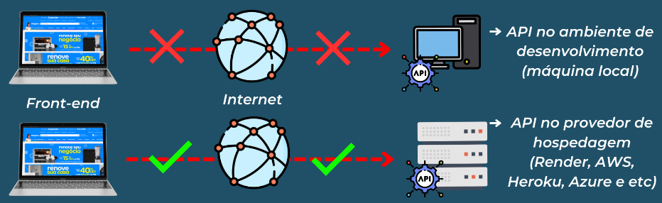

<h1 style="font-size: 50px; text-align: center">NodeJS</h1>

# Sumário

1. <a href="#api">API</a>
2. <a href="#Nodejs-introducao">Node.js: Introducao</a>
3. <a href="#Nodejs-primeiro-projeto">Node.js: Primeiro Projeto</a>
4. <a href="#Nodejs-recebendo-parametros">Node.js: Recebendo Parâmetros</a>
5. <a href="#api-restful-colecao-dados">Node.js: APIs RESTful e Coleção de Dados</a>
6. <a href="#publicando-api-internet">Node.js: Publicando API na Internet</a>

# <p id="api">API</p>

API - Application Programming Interface.

- permitem a comunicação entre diferentes softwares.
- API recebe a requisição do fron-end, traduz e envia para a camada interna que processo
  os dados numa linguagem que o back end entenda.
  - normalmente os programadores front-end só devem se preocupar em consumir uma API
    para poder se comunicar com o back-end.

_Nota: integração de sistemas é uma forma de conectar sistemas para que trabalhem juntos._

## Padrão REST

Mais utilizada dentro do mercado, se comunicando com o front-end através da linguagem padrão REST.

- REST: define regras e padrões para comunicação entre front-end e a API RESTful.

Padrão REST:

1. Endpoints.
2. verbos HTTP.
3. JSON.
4. Códigos de Status.

## Endpoint

URLs que são disponibilizados pelo back-end para que o front possa acessar as funções
criadas no back-end.

Exemplo: Endpoint para funções.
`https://dominio.com.br/funcao/parametro`

- divisões:
  1. dominio: local onde API está hospedada.
  2. função: executada no backend.
  3. valor: valor usado no função.


Exemplo: Endpoint para manipulação de dados.
`https://dominio.com.br/dados/parametro`

- divisões:
  1. site.
  2. dados: coleção de dados que serão manipulada.
  3. valor.
- funcionalidade:
  1. cadastrar.
  2. alterar.
  3. consultar.
  4. excluir.

_OBS: normalmente o uso do parâmetro se dá com intuito de manipular um registro específico._

## Verbos HTTP

_Nota: o front-end pode enviar informações para back-end por meio de verbos HTTP e conteúdos JSON._

Formas de Consumir uma API com HTTP:

1. GET - obtem os dados.
2. POST - insere os dados.
3. PUT/PATCH - atualiza os dados.
   PUT - usado quando se deseja realizar uma atualização completa de informação, por exemplo, atualizar um produto.
   PATCH - usado quando se deseja atualizar um dado específico, por exemplo, o nome de um produto.
4. DELETE - exclui os dados.


## JSON

Normalmente é utilizado o formato de dados JSON no padrão REST.

Exemplo: sintaxe.

```
{
    "chave": "valor",
    "chave2": "valor2",
    ...
}
```

O formato JSON aceita 3 tipos de valores, que são: textos, valores numéricos e valores booleanos.


## Código de Status

Código enviado junto com a resposta que indica o status da requisição.

Categorias:


Significado de cada categoria:

- 100 a 199 (resposta de informação): solicitação em andamento.
- 200 a 299 (resposta de sucesso): operação bem sucedida.
- 300 a 399 (redirecionamento): solicitação recebida necessita de mais algumas ações do front-end.
- 400 a 499 (erro do cliente): erro vindo do front-end.
- 500 a 599 (erro no servidor): erro no back-end.

Principais códigos de status:


## Postman

Forma simplificada de enviar uma requisição e receber um retorno.

_Nota: todos os testes realizados abaixo fora feitos utilizando o endpoint:_ `http://devup.com.br/gotour/api/pacotes/`

Exemplo: colletion.


Exemplo: retornando pacotes.


Exemplo: retornando um pacote.


Exemplo: criando um pacote.



Exemplo: alterando um pacote.


Exemplo: atualizando um pacote.


Exemplo: deletando um pacote.


# <a id="Nodejs-introducao">Node.js: Introducao</a>

Plataforma server-side que permite criação de aplicações JS standalone, ou seja, que não depende de um navegador para a execução.

_Nota: npm é o gerenciador de dependências que já vem instalado junto com o node._

- dependências podem ser bibliotecas externas necessárias para o funcionamento da aplicação.

# <a id="Nodejs-primeiro-projeto">Node.js: Primeiro Projeto</a>

_Nota: a comunicação entre o frontend e o backend se dá através de requisições e respostas._

- requisição: caracterizada por ser um envio de pacotes para o backend.
- resposta: também pode ser um pacote de dados, isto é, uma mensagem de sucesso ou falha.

Protocolo HTTP - meio de comunicação onde trafegam requisições e respostas.

- protocolo padrão para navegação na internet.

## APIs

Conjunto de padrões usados para a comunicação entre sistemas.


A API é uma interface que padroniza a comunicação entre as aplicações frontend e backend.

- recebe os dados da requisição e envia ao backend.

## Express.js

Framework minimalista para Node.js e o seu objetivo é simples.

## API REST


Principais diretrizes do REST:

1. Protocolo HTTP.
2. Verbos HTTP - GET, POST, PUT, PATCH, DELETE .
3. Formato JSON - formato de dados universal compreendido por todas as tecnologias.

Arquitetura da API RESt:

1. Camada de dados - base de toda a aplicação.
2. Camada de serviço - funções da aplicação.

   - consome a camada de dados.

3. Camada REST - requisições HTTP.
   - consome a camada de serviço.

# <a id="Nodejs-recebendo-parametros">Node.js: Recebendo Parâmetros</a>

O principal objetivo do envio de parâmetros através das requisições e respostas
é permitir a comunicação entre front-end e back-end.

- recebimento de dados.

## Recebendo Requisições na API com Express

Os parâmetros são enviados via URL, e internamente serão convertidos para o formato
JSON.

Exemplo: recebendo parâmetros.


## Tratando Erros na API

A validação evita que os dados inválidos cheguem até a API.

_Nota: dados inválidos podem oferecer erros a API, assim como oferecer riscos de segurança ao sistema._

Códigos de Status mais utilizados:

1. 200 - requisição feita com sucesso.
2. 400 - requisição inválida.
3. 404 - Não encontrado.
4. 500 - Erro interno de servidor.

# <p id="api-restful-colecao-dados">Node.js: APIs RESTful e Coleção de Dados</p>

Relembrando:

- API - realiza a comunicação entre diferentes sistemas.
- REST - endpoints, verbos http, dados JSON e código de status.

_Nota: endpoints não terminam em barra._

_Nota: uma API que retorna dados de uma coleção, deve usar um endpoint que represente o contexto dos dados._

Exemplo:


Domínio - contexto da coleção de dados.

- um sistema pode possuir mais de um domínio.

_OBS: dentro do padrão REST, sempre que houver manipulação de dados, uma coleção deve ter uma coluna de id._

Método find() - permite buscar um item específico dentro uma coleção de dados.

- recebe uma função de callback, que terá como parâmetro cada elemento da coleção.

Exemplo: endpoint de busca em uma coleção de dados.
`localhost:8080/ufs?parametro=valor`

- ?: indique é uma busca.
- parametro: parâmetro de busca.

_OBS: uso dos espaços em buscas._

# <p id="publicando-api-internet">Node.js: Publicando API na Internet</p>

Nomenclaturas:

1. Maquina local = Ambiente de desenvolvimento.
2. Endereço público = ambiente do produção.

Tipos de APIs:

1. públicas - acessíveis para qualquer aplicação.
2. privadas - necessitam de autenticação para serem consumidas.

Para publicar uma API na internet é necessário hospedar o seu código em um servidor, para isso é utilizado um provedor de hospedagem.

- provedor de hospedagem: serviço que disponibiliza um servidor.



## Hospedagem no Render

Etapas:

1. selecionar Web Services > configure account.
2. selecionar repositorio > clique em connect.
3. informe nome > region, branch, root directory deixar padrão.
4. selecione Node como runtime > build command deixar padrão.
5. start command informar comando de inicialização definido em máquina local.
6. selecionar plano > fim.

## Hospedagem no Azure

Plataforma de hospedagem em nuvem da microsoft.

Etapas plano assinatura:

1. Assinaturas > clique em adicionar.
2. selecionar plano: microsoft azure plan > finalizar.

Etapas Grupos e Recursos: local onde a API será armazenada.

1. na página inicial, procurar por Grupos de Recursos > clique em criar.
2. preencha os campos da mesma forma que a imagem a baixo > clique em revisar + criar > finalizar.


Etapas Serviços de Aplicativos:

1. na página inicial, procurar por Serviços de Aplicativos > clique em criar, e em seguida aplicativo web.
2. preencha os campos da mesma forma que a imagem a baixo > clique em revisar + criar > finalizar.


Etapas Extensão Azure Visual Studio:

1. instalar Azure App Service > realizar login.
2. vá na extensão > acesse o plano criado.
3. procure app services > com o botão direito, clique em no grupo e recursos criado (ex: apihistoricoipca).
4. selecione a opção deploy to web app > selecione a pasta do projeto de api.
5. aguarda finalização de upload > clique em browse website.
