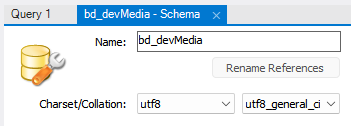
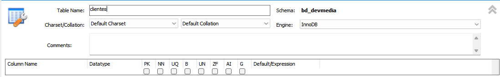
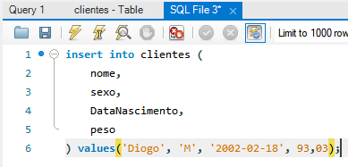
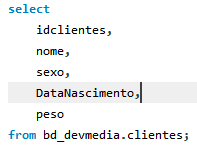
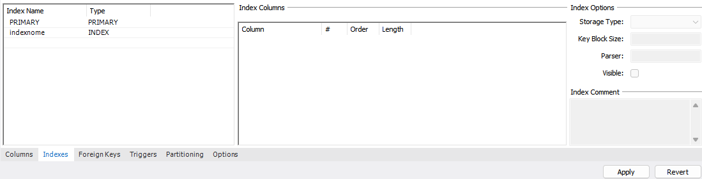
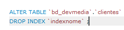
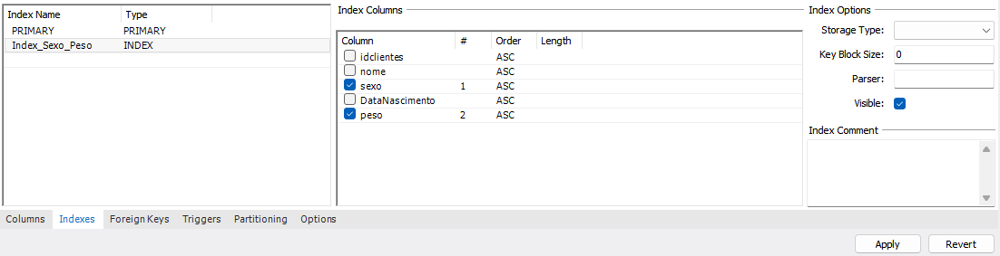
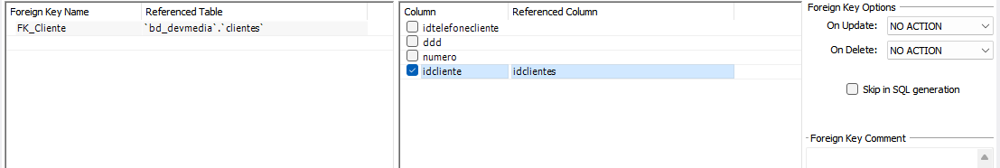
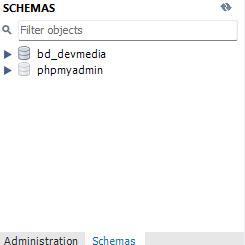
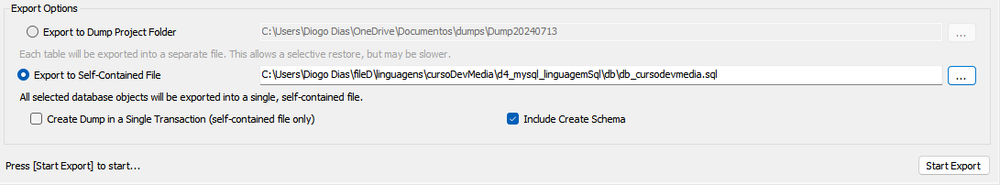

# MYSQL E LINGUAGEM SQL

## Sumário

1. <a href="#introducao-banco-dados-mysql">Introdução ao Banco de Dados MySql</a>
2. <a href="#introducao-linguagem-sql">Introdução a Linguagem SQL</a>

## <p id="introducao-banco-dados-mysql">Introdução ao Banco de Dados MySql</p>

_Nota: O SGBD MariaDB é um fork do MySQL, criado pelo próprio fundador do projeto após sua aquisição pela oracle._

Schemas - bancos de dados presentes no servidor.

Criando um Schema:

1. clique em create new schema > insira um nome.
2. selecione um collation > clique em apply.
   - collation: conjunto de caracteres que o banco de dados possui internamente.



_OBS: no arquivo my.ini possui as principais configurações presentes no mysql, como por exemplo, a localização de todos as bases de dados._

### Criação de Tabela

Tabela - arquivo dentro do banco de dados onde estarão presente as informações, que podem está dispostas em índices, colunas, chaves primárias/estrangeiras.

Etapas de criação:

1. no schema utilizado, clique com o botão direito em tables > selecione create tables.
2. insira o nome da tabela, selecione uma engine > preenchimento dos campos da tabela.
   - engine: controla como o MySQL irá executar os comandos.
     - mais utilizadas InnoDB e MyISAM. InnoDB, trabalha baseado em transações; e o MyISAM, vai dá look na tabela quando ocorrer necessidade de alteração.

_Nota: o InnoDB sempre será indicado para base de dados que sofreram bastante alterações._



Condigurações de Campos:

1. column Name - nome de uma coluna.
   - nunca utilizar acentos ou espaços.
2. Data Type - define o tipo de campo criado.
3. Chave Primária - define a identificação de um registro exclusivo e único.
4. Not null - define que um determinado campo deve ser preenchido.
5. Unique Index - garante que determinado campo não será repetido.
6. auto incremento - incrementa um valor automaticamente.
   - geralmente utilizado com a chave primária.
7. zero filled - utilizado para incluir determinado números de zeros a esquerda.
8. default - define um valor padrão.

_Nota: o índice é uma forma que o banco de dados tem de organizar a estrutura de uma determinada tabela para facilitar a sua pesquisa._

Comandos SQL:

- Insert - comando utilizado para inserir um novo registro no banco.
  
- Select - resgata informações da base de dados.</br>
  

### Criação de Índices



Exemplo: deletando um index.</br>


Índice Composto - definido quando temos mais de um campo formando um único índice.



### Criação de Chave Estrangeira

Responsável pelo relacionamento entre as tabelas, por exemplo, a chave primária da tabela cliente pode está definida como chave estrangeira em uma tabela telefone.

Exemplo: Criação de chave estrangeira.


_OBS: não se pode deletar um registro que possua dependência, ou seja, não se pode excluir uma chave primária que está sendo utilizado para o relacionamento em outra tabela._

### Exportanto o Banco de Dados

Ambientes de Desenvolvimento - ambiente da máquina local onde será desenvolvida as aplicações e banco de dados.

Ambiente de Produção - representa o servidor onde a base de dados estará rodando de fato.

O Backup é um ponto crucial em um banco de dados para que as informações possam ser enviadas para um outro local. Ou seja, com ele podemos ter a segurança de que as informações produzidas não seja perdidas.

O exportanção de base de dados permite inserir as informações em um novo ambiente, por exemplo, no servidor web ou na nuvem.

Etapas para Exportar os Dados:

1. no mysql workbench, acesse sua base de dados.
2. clique sobre management/administration > clique em data export.</br>
   
3. selecionar a base de dados > selecione a opção abaixo.
   

## <p id="introducao-linguagem-sql">Introdução a Linguagem SQL</p>

Linguagem padrão em sistemas de gerenciamento de bancos de dados relacionais.

Tipos de Conjunto de Comandos em SQL:

1. DDL - comandos relacionados a criação de banco de dados, esquemas tabelas, campos e etc.
   - comandas: `CREATE, ALTER e DROP`.
2. DML - comandos que lidam com os dados.
   - comandos: `INSERT, UPDATE e DELETE`.
3. DQL - comandos focados na consulta de dados.
   - comandos: `SELECT`.
4. DTL - comandos voltados para transações de dados.
5. DCL - comandos usados para controlar e gerenciar permissões de acesso de usuários ao banco de dados.

### Data Definition Language (DDL)

Principais comandos:

- `CREATE TABLE`.
- `DROP TABLE`.
- `ALTER TABLE`.
- `TRUNCATE`.

Exemplo: Criação de tabelas.

```
CREATE TABLE nameTable (
   propriedade tipo,
   nome varchar(11),
   ...
);
```

Exemplo: Excluindo tabela.

```
DROP TABLE nameTable;
```

- remove a tabela e todos os dados contidos nela.

Exemplo: Modificando uma Tabela.

```
ALTER TABLE nameTable
   ADD nameColumn tipo;
```

Exemplo: Excluindo registros de uma tabela.

```
TRUNCATE TABLE nameTable
```

### Data Manipulation Language e Data Query Language (DML/DQL)

Principais Comandos:

- `INSERT`.
- `DELETE`.
- `UPDATE`.
- `SELECT`.

Exemplo: Inserindo dados na tabela.

```
INSERT INTO nameTable (column1, column2)
   values (value1, value2);
```

Exemplo: Exclusão de Registros.

```
DELETE FROM nameTable WHERE id = 2; -- Exclui registro específico

DELETE FROM nameTable; -- Exclui todos os registros
```

Exemplo: Atualizando os dados da tabela.

```
UPDATE nameTable SET nameColumn = newValue WHERE id = 3; -- Atualiza dado específico

UPDATE nameTable SET nameColumn = newValue; -- Atualiza todos os dados
```

Exemplo: Recuperando dados da tabela.

```
SELECT column1, column2, columnN FROM nameTable; -- Retorna colunas específicas

SELECT * FROM nameTable; -- Retorna todas as colunas da tabela

SELECT * FROM nameTable WHERE nameColumn = value; -- Retorna todas as colunas da tabela que corresponde ao valor especificado

SELECT * FROM nameTable1 t1
   JOIN nameTable2 t2 ON t1.id = t2.id; -- Retorna todas as colunas da tabela que corresponde a união.
```
