# MYSQL E LINGUAGEM SQL

## Sumário

1. <a href="#introducao-banco-dados-mysql">Introdução ao Banco de Dados MySql</a>
2. <a href="#introducao-linguagem-sql">Introdução a Linguagem SQL</a>
3. <a href="#comando-select">Linguagem SQL: Comando Select</a>
4. <a href="#clausula-where">Linguagem SQL: Cláusula WHERE</a>
5. <a href="#insert">Linguagem SQL: INSERT</a>
6. <a href="#update">Linguagem SQL: UPDATE</a>
7. <a href="#delete">Linguagem SQL: DELETE</a>
8. <a href="#like">Linguagem SQL: Like</a>
9. <a href="#in">Linguagem SQL: IN</a>
10. <a href="#order-by">Linguagem SQL: Order By</a>
11. <a href="#funcao-agregacao">Linguagem SQL: Funções de Agregação</a>
12. <a href="#agrupamento-dados">Linguagem SQL: Agrupamento de Dados</a>
13. <a href="#juncao-tabela">Linguagem SQL: Junção de Tabela</a>
14. <a href="#juncao-tabela">Linguagem SQL: União de Consultas</a>
15. <a href="#data">Linguagem SQL: Data</a>
16. <a href="#operador-intersect">Linguagem SQL: Operador Intersect</a>
17. <a href="#operador-minus">Linguagem SQL: Operador Minus</a>
18. <a href="#subquery">Linguagem SQL: Subquery</a>

## <p id="introducao-banco-dados-mysql">Introdução ao Banco de Dados MySql</p>

_Nota: O SGBD MariaDB é um fork do MySQL, criado pelo próprio fundador do projeto após sua aquisição pela oracle._

Schemas - bancos de dados presentes no servidor.

Criando um Schema:

1. clique em create new schema > insira um nome.
2. selecione um collation > clique em apply.
   - collation: conjunto de caracteres que o banco de dados possui internamente.

_OBS: no arquivo my.ini possui as principais configurações presentes no mysql, como por exemplo, a localização de todos as bases de dados._

### Criação de Tabela

Tabela - arquivo dentro do banco de dados onde estarão presente as informações, que podem está dispostas em índices, colunas, chaves primárias/estrangeiras.

Etapas de criação:

1. no schema utilizado, clique com o botão direito em tables > selecione create tables.
2. insira o nome da tabela, selecione uma engine > preenchimento dos campos da tabela.
   - engine: controla como o MySQL irá executar os comandos.
     - mais utilizadas InnoDB e MyISAM. InnoDB, trabalha baseado em transações; e o MyISAM, vai dá look na tabela quando ocorrer necessidade de alteração.

_Nota: o InnoDB sempre será indicado para base de dados que sofreram bastante alterações._

Exemplo: Criação de tabela.</br>
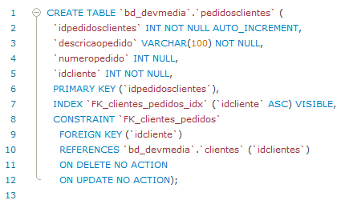

Condigurações de Campos:

1. column Name - nome de uma coluna.
   - nunca utilizar acentos ou espaços.
2. Data Type - define o tipo de campo criado.
3. Chave Primária - define a identificação de um registro exclusivo e único.
4. Not null - define que um determinado campo deve ser preenchido.
5. Unique Index - garante que determinado campo não será repetido.
6. auto incremento - incrementa um valor automaticamente.
   - geralmente utilizado com a chave primária.
7. zero filled - utilizado para incluir determinado números de zeros a esquerda.
8. default - define um valor padrão.

_Nota: o índice é uma forma que o banco de dados tem de organizar a estrutura de uma determinada tabela para facilitar a sua pesquisa._

Comandos SQL:

- Insert - comando utilizado para inserir um novo registro no banco.
- Select - resgata informações da base de dados.</br>
  

### Criação de Índices


Exemplo: Criando um index.</br>
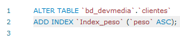

Exemplo: deletando um index.</br>


Índice Composto - definido quando temos mais de um campo formando um único índice.


### Criação de Chave Estrangeira

Responsável pelo relacionamento entre as tabelas, por exemplo, a chave primária da tabela cliente pode está definida como chave estrangeira em uma tabela telefone.


_OBS: não se pode deletar um registro que possua dependência, ou seja, não se pode excluir uma chave primária que está sendo utilizado para o relacionamento em outra tabela._

### Exportanto o Banco de Dados

Ambientes de Desenvolvimento - ambiente da máquina local onde será desenvolvida as aplicações e banco de dados.

Ambiente de Produção - representa o servidor onde a base de dados estará rodando de fato.

O Backup é um ponto crucial em um banco de dados para que as informações possam ser enviadas para um outro local. Ou seja, com ele podemos ter a segurança de que as informações produzidas não seja perdidas.

O exportanção de base de dados permite inserir as informações em um novo ambiente, por exemplo, no servidor web ou na nuvem.

Etapas para Exportar os Dados:

1. no mysql workbench, acesse sua base de dados.
2. clique sobre management/administration > clique em data export.</br>
   
3. selecionar a base de dados > selecione a opção abaixo.

## <p id="introducao-linguagem-sql">Introdução a Linguagem SQL</p>

Linguagem padrão em sistemas de gerenciamento de bancos de dados relacionais.

Tipos de Conjunto de Comandos em SQL:

1. DDL - comandos relacionados a criação de banco de dados, esquemas tabelas, campos e etc.
   - comandas: `CREATE, ALTER e DROP`.
2. DML - comandos que lidam com os dados.
   - comandos: `INSERT, UPDATE e DELETE`.
3. DQL - comandos focados na consulta de dados.
   - comandos: `SELECT`.
4. DTL - comandos voltados para transações de dados.
5. DCL - comandos usados para controlar e gerenciar permissões de acesso de usuários ao banco de dados.

### Data Definition Language (DDL)

Principais comandos:

- `CREATE TABLE`.
- `DROP TABLE`.
- `ALTER TABLE`.
- `TRUNCATE`.

Exemplo: Criação de tabelas.

```
CREATE TABLE nameTable (
   propriedade tipo,
   nome varchar(11),
   ...
);
```

Exemplo: Excluindo tabela.

```
DROP TABLE nameTable;
```

- remove a tabela e todos os dados contidos nela.

Exemplo: Modificando uma Tabela.

```
ALTER TABLE nameTable
   ADD nameColumn tipo;
```

Exemplo: Excluindo registros de uma tabela.

```
TRUNCATE TABLE nameTable
```

### Data Manipulation Language e Data Query Language (DML/DQL)

Principais Comandos:

- `INSERT`.
- `DELETE`.
- `UPDATE`.
- `SELECT`.

Exemplo: Inserindo dados na tabela.

```
INSERT INTO nameTable (column1, column2)
   values (value1, value2);
```

Exemplo: Exclusão de Registros.

```
DELETE FROM nameTable WHERE id = 2; -- Exclui registro específico

DELETE FROM nameTable; -- Exclui todos os registros
```

Exemplo: Atualizando os dados da tabela.

```
UPDATE nameTable SET nameColumn = newValue WHERE id = 3; -- Atualiza dado específico

UPDATE nameTable SET nameColumn = newValue; -- Atualiza todos os dados
```

Exemplo: Recuperando dados da tabela.

```
SELECT column1, column2, columnN FROM nameTable; -- Retorna colunas específicas

SELECT * FROM nameTable; -- Retorna todas as colunas da tabela

SELECT * FROM nameTable WHERE nameColumn = value; -- Retorna todas as colunas da tabela que corresponde ao valor especificado

SELECT * FROM nameTable1 t1
   JOIN nameTable2 t2 ON t1.id = t2.id; -- Retorna todas as colunas da tabela que corresponde a união.
```

## <p id="comando-select">Linguagem SQL: Comando Select</p>

Exemplo: Buscando dados do cliente.</br>
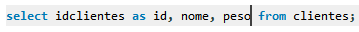

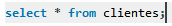

Clásula Where - permite filtrar os registros nas consultas.

Exemplo:</br>
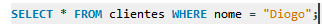

Operadores de Where:

1. `LIKE` - busca determinada string dentro de um campo de valores textuais.
   - 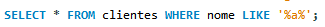
   - " % " funciona como um coringa que pode ser qualquer valor.
   - " \_ " busca por um termo em uma posição específica.
2. `IN` - filtra o valor de um dos campos de uma tabela a partir de uma lista e possibilidades.
   - verifica se o valor de um campo se encontra em uma lista.
   - 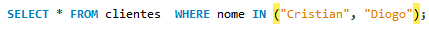
3. `AND, OR, NOT`.

### DISTINCT

Utilizado para eliminar consultas que possuem registros repetidos.

Exemplo:</br>
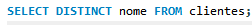

### TOP

Especifica o número de linhas que devem ser retornadas no resultado da consulta.

_OBS: recurso não disponível para todos os SGBDS._

- MySQL - LIMIT.
- Oracle - ROWNUM.
- Firebird - FIRST.

_Nota: utilizado normalmente com ORDER BY._

Exemplo: Utilizando a sintaxe para MySQL.</br>
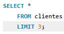

Exemplo: Ordenando o resultado.</br>
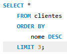

Exemplo:

```
SELECT * FROM alunos
   ORDER BY nome DESC
   LIMIT 3
   OFFSET 1;
```

- `OFFSET`: omite o primeiro resultado.

## <p id="clausula-where">Linguagem SQL: Cláusula WHERE</p>

Operador `BETWEEN` - permite realizar uma consulta entre uma determinada faixa de valores.

Exemplo:

```
SELECT * FROM clientes WHERE id BETWEEN 2 AND 4;
```

- pode ser utilizado para verificar intervalos de datas, caracteres e outros.

## <p id="insert">Linguagem SQL: INSERT</p>

Responsável pelo inserção de uma ou mais linhas em uma tabela.

Exemplo:

```
INSERT INTO
   table
   (column1, column2, ...)
   VALUES
      (value1, value2, ...),
      ( ... )
```

Exemplo: inserindo valores pelo select.

```
INSERT INTO
   table
   (column1, column2, ...)
   (SELECT value1, value2, ... FROM table),
```

## <p id="update">Linguagem SQL: UPDATE</p>

Permite a alteração de um ou mais dados armazenados na tabela.

Exemplo:

```
UPDATE
   table
SET
   column = 'new value'
WHERE
   column = value -- condição para não alterar todos os campos
```

## <p id="delete">Linguagem SQL: DELETE</p>

Permite que uma ou mais linhas sejam excluidas de uma tabela.

Exemplo:

```
DELETE FROM
   table
   WHERE
   column = value -- condição para um único valor
```

_OBS: sempre deve ser utilizado WHERE para que não seja excluido todos os campos de uma tabela._

## <p id="exists">Linguagem SQL: Exists</p>

Testa quando há um ou mais resultados em uma subquery, e retorna um valor true, permite filtrar colunas dentro de uma subconsulta.

- aplicada quando se deseja trazer um resultado onde seu valor existe em outra tabela.

Exemplo:

```
SELECT
   column1, column2, ...
   FROM
      table1, table2, ...
   WHERE
      EXISTS (
         SELECT
            column1, column2, ...
         FROM
            table1, table2, ...
         WHERE
            condition
      )
```

## <p id="like">Linguagem SQL: Like</p>

Busca por padrões de textos em uma coluna, de forma semelhante a expressão regulares.

Exemplo:

```
SELECT
   column1, column2
   FROM
      table1, table2,
   WHERE
      table1.column1 LIKE caracteres
```

- operadores: " % " (0 ou mais de um caracteres de texto) e " \_ " (1 caractere).

## <p id="in">Linguagem SQL: IN</p>

Operador usado para especificar vários valores em uma clásula WHERE.

- verifica se determinada coluna está sendo mencioanda em um grupo de valores.

Exemplo:

```
SELECT
   column1, column2, ...
   FROM
      table1, ...
   WHERE
      column IN [value1, value2, value3, ...]
```

## <p id="order-by">Linguagem SQL: Order By</p>

Solicita a ordenação dos dados no comando select.

Exemplo:

```
SELECT
   columns
   FROM
      tables
   WHERE
      conditions
   ORDER BY
      column or columns
```

- ASC ou DESC, para ordenação crescente ou descrescente respectivamente.

## <p id="funcao-agregacao">Linguagem SQL: Funções de Agregação</p>

SUM - função de soma.</br>
`SELECT SUM(column) FROM table WHERE condition`

AVG - função de média.</br>
`SELECT AVG(column) FROM table WHERE condition`

MAX/MIN - funções que retornam os valores máximos e mínimos.</br>
`SELECT MAX(column) FROM table WHERE condition`
`SELECT MIN(column) FROM table WHERE condition`

COUNT - função que conta os registros da tabela.
`SELECT COUNT(*) FROM table WHERE condition`

- por padrão está função descarta valores nulos.

## <p id="agrupamento-dados">Linguagem SQL: Agrupamento de Dados</p>

GROUP BY - realiza o agrupamento dos dados que possuem os mesmo valores.

Exemplo:

```
SELECT data_venda FROM vendas GROUP BY data_venda
```

- agrupa todos os valores pela data.

Exemplo: retornando somatorio de quantidade acima de 3.

```
SELECT data_venda, SUM(quantidade)
   FROM vendas
   WHERE codigo_produto = 200
   GROUP BY data_venda
   HAVING SUM(quantidade) > 3 -- retorna somente a soma daqueles maiores que 3
```

## <p id="juncao-tabela">Linguagem SQL: Junção de Tabela</p>

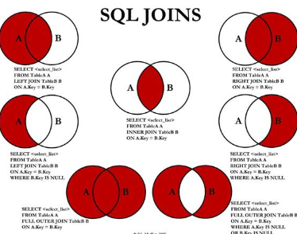

INNER JOIN - trás os dados de uma tabela1 relacionados com outra tabela2, desde que haja um correspondente em ambas as tabelas.

```
SELECT
   t1.column1,
   t1.column2,
   t2.column1,
   t2.column2
   FROM tabela1 AS t1
      INNER JOIN tabela2 AS t2 ON t1.column1 = t2.column1
```

LEFT JOIN - registra todos os dados da tabela a esquerda mesmo que não existe na tabela a direita.

- RIGHT JOIN - realiza o processo inverso.

```
SELECT
   t1.column1,
   t1.column2,
   t2.column1,
   t2.column2
   FROM tabela1 AS t1
      LEFT JOIN tabela2 AS t2 ON t1.column1 = t2.column1
```

- no exemplo acima a tabela1 está a esquerda, e a tabela2 está a direita.

OUTER JOIN - retorna todos os registros que estão presentes em duas tabelas distintas.

```
SELECT
   t1.column1,
   t1.column2,
   t2.column1,
   t2.column2
   FROM tabela1 AS t1
      OUTER JOIN tabela2 AS t2 ON t1.column1 = t2.column1
```

## <p id="uniao-consultas">Linguagem SQL: União de Consultas</p>

Uniao entre duas consultas distintas para retornar apenas um único resultado.

- os registros que forem iguais serão ignorados.

Exemplo:

```
SELECT column1, column2, column3 FROM table1
UNION
SELECT column1, column2, column3 FROM table2

# RETORNA TODOS OS REGISTROS
SELECT column1, column2, column3 FROM table1
UNION ALL
SELECT column1, column2, column3 FROM table2
```

_OBS: as colunas de ambas as consultas devem está na mesma sequência para realizar a união._

_Nota: os SGBDs não permitem que ORDER BY seja aplicado em queries que ainda serão unidas._

## <p id="data">Linguagem SQL: Data</p>

Fornece funções que permitem trabalhar com informações do tipo Date.

Exemplo:

```
SELECT DAY(tabela1.column1) FROM tabela1

SELECT MONTH(tabela1.column1) FROM tabela1

SELECT YEAR(tabela1.column1) FROM tabela1
```

Exemplo: retorna os meses mais lucrativos do ano.

```
SELECT
   MONTH(v.data) AS mes,
   SUM(v.valor) AS total_recebido
   FROM
      vendo_produto v
   GROUP BY mes
   ORDER BY total_recebido DESC
   LIMIT 0, 2
```

## <p id="operador-intersect">Linguagem SQL: Operador Intersect</p>

Retorna os resultados que estão presentes em dois conjuntos.

Exemplo:

```
SELECT
   column1
   FROM
   table1
INTERSECT
SELECT
   column2
   FROM
   table2
```

## <p id="operador-minus">Linguagem SQL: Operador Minus</p>

Realiza a operação de subtração entre duas queries.

Exemplo:

```
SELECT
   column1
   FROM
   table1
MINUS
SELECT
   column2
   FROM
   table2
```

## <p id="subquery">Linguagem SQL: Subquery</p>

Uma subconsulta é uma instrução do tipo `SELECT` dentro de uma outra instrução.

Exemplo:

```
SELECT
   column1, column2, ...
   FROM
      table1, subquery AS tabela2
   WHERE
      condition1, condition2, column = subquery ...
```

Exemplo: aplicando uma subquery em INSERT.

```
INSERT INTO table(column1, column2, column3)
   subquery
```

Formas de utilização:

- SELECT AS FIELDS - nova coluna da consulta.
  1.  obs1: sempre deve retornar uma única coluna.
- IN, EXISTS ou operadores de comparação - filtro de uma consulta.
  1.  obs1: podem retornar N valores, mas apenas uma única coluna.
- SELECT FROM SELECT - fonte de dados de uma consulta principal.
  1.  obs1: é obrigatório a utilização do alias.
