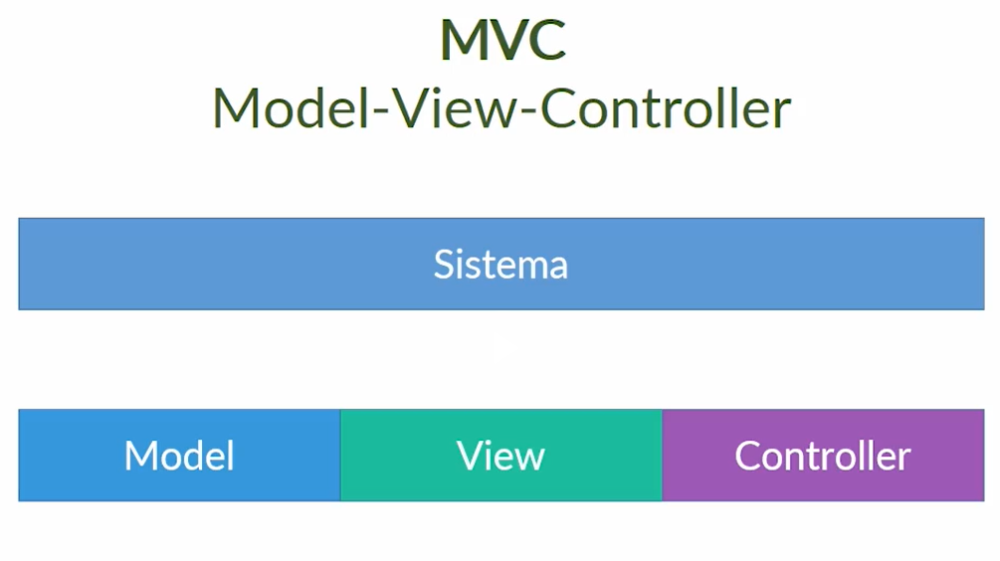

# MVC - Model View Controller

## Sumário

1. <a href="#introducao">MVC: Introdução</a>

## 
MVC: Introdução

Os elementos de um software pode ser determinado pela sua arquitetura.

Tipos de elementos em uma arquitetura:

1. Utilitários.
2. interação.
3. domínio do problema.
4. conexão.
5. persistência.

Proporciona uma manutenção mais fácil e de possível reaproveitamento de classes e partes do projeto.

Vantagens:

- Baixo Acoplamento - se uma classe A conhece uma classe B pela sua interface.
- Coesão - classe com um único propósito.

Benefícios:

- maior produtividade.
- estrutura uniforme.
- baixa complexidade.
- aplicação fácil de manter.
- facilita na documentação.
- vocabulário comum.
- reutilização de módulos.
- software mais confiável.
- menor tempo de desenvolvimento.

Objetos de padrão MVC:

1. Controller: interpreta entradas do usuário, e envia comandos para view ou model.
   - recebe requisições do usuário.
   - os dados são tratados antes de passar para view.
2. Model: gerencia os elementos de dados.
   - modela as entidades do sistema.
   - recebe, trata e valida dados.
3. View: apresenta informações ao usuário.
   - visualização com o usuário.
   - interação user <-> application.

Padrões variantes:

- MVP.
- MVVM.
