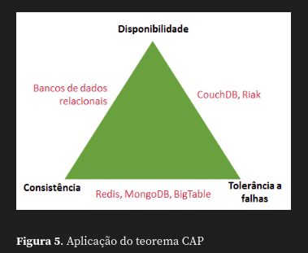

# MONGO DB

# Sumário

1. <a href="#introducao-nosql">Introdução ao NoSQL</a>
2. <a href="#conceitos-nosql">Conceitos acerca do NoSQL</a>
3. <a href="#estrutura-mongodb">Estrutura de Funcionamento do MongoDB</a>
4. <a href="#crud-mongodb">Operações C.R.U.D com MongoDB</a>
5. <a href="#capped-collections-mongodb">Capped Collections com MongoDB</a>
6. <a href="#operadores-mongodb">Operadores do MongoDB</a>

---

# <p id="introducao-nosql">Introdução ao NoSQL</p>

Bancos não relacionais podem conter relacionamentos, mas no geral eles não se relacionais.
- garante um melhor desempenho quando se lida com grandes volumes de dados.
- possui diferentes formas de armazenamento.
  1. Grafos.
  2. Documentos.
  3. Colunas.
- esquemas mais flexíveis.

Tipos de Bancos NoSQL:

**Orientados a Colunas**
- Cassandra.
- Hypertable.
- MonetDB.

**Chave-Valor**
- Table Storage.
- DynamoDB.
- Redis.

**Grafos**
- Neo4j.
- Infinite Graph.
- ArangoDB.

**Documentos**
- MongoDB.
- CouchDB.
- DocumentDB.

## Exemplos práticos - MongoDB

```bash
# Inicia o MongoDB
sudo systemctl start mongod

# Executa o Mongo na linha de comando
mongosh
```

Comandos básicos MongoDB:

```bash
# Criação de banco de dados
use database_name

# Criando uma coleção
db.colecao_name

# Inserindo um registro na coleção
db.colecao_name.insertOne({ chave: valor, ..., chaveN: valorN })

# Retorna uma coleção
db.colecao_name.find()

# Criação de filtro
db.colecao_name.find({ "column_name": valor })
```

O MongoDB é orientado a documentos (Documentos = Linhas) que são armazenados em coleções (Coleções = Tabelas).

---

# <p id="conceitos-nosql">Conceitos acerca do NoSQL</p>

_Nota: o modelo relacional é mais indicado de uso quando estamos lidando com entidades que possam ser presentadas por um modelo estritamento rígido e bem estruturado_

_**Escalabilidade**: capacidade do sistema suportar um aumento substancial de carga sem piorar o desempenho._

_**ACID**: Atomicidade, Consistências, Isolamento e Durabilidade._
- atomicidade: agrupa operações em uma unidade trabalho, permitindo recuperar a base em seu estado anterior em casos de falhas.
- isolamento: uma transação não pode ter acesso aos dados de outra.
- Durabilidade: garante que os dados sejam persistidos após a finalização da transação.

Em comparação com os modelos **RELACIONAIS**, as bases de dados **NÃO RELACIONAIS** apresentam uma maior performance e escalabilidade.


- Consistência: todos os nós do sistema distribuído acessam exatamente a mesma informação a qualquer momento.
- Disponibilidade: toda requisição recebida pelo sistema gerará uma resposta.
- Tolerância a falhas: o sistema continua a funcionar caso um dos seus sistemas enfrente dificuldades.

Caracteristica chave-valor - toda consulta do banco de dados se dá apenas por uma chave identificadora.
- mecanismo de cache: expiração de chaves para evitar a execução de procedimentos computacionais caros repetidos.

_Nota: a chave identificadora é transformada (função transformadora) em um valor numérico que representa o endereço de memória._

**O modelo documental** utilizado por bases não relacionais utilizam a agregação, que é semelhante ao modelo relacional.

_Nota: para lidar com arquivos digitais o modelo digital é o mais indicado._

---

# <p id="estrutura-mongodb">Estrutura de Funcionamento do MongoDB</p>

Trabalha com o formato de documentos (Linha), atributos (colunas) e coleções (Tabela).

Funções:
1. `db.collectionName.countDocument()`.

## Tipos de Dados

Free Schema Design - flexibilização da estrutura presente em bases relacionais.

_Nota: dentro do mongodb um documento é independente de outro._
- documentos com diferentes estruturas podem estar na mesma coleção.

_Nota: o mongodb trabalha com os tipos de objetos do javascript._

Exemplo: inserção de dados.

```bash

# Date
db.collectionName.insertOne({ "col2": new Date() })

# Number
db.collectionName.insertOne({ "col2": 4 })

# String
db.collectionName.insertOne({ "col2": 'string data' })

# Float
db.collectionName.insertOne({ "col2": 33.33 })

# Array
db.collectionName.insertOne({ "col2": ['first', 'second', 3] })

# Boolean
db.collectionName.insertOne({ "col2": true })
```

`findOne()` - método que realiza uma pesquisa baseada em um filtro.

```bash
db.collectionName.findOne({ col1: 4 })
```

Exemplo: criando relação entre coleções.

```bash
# Collection 1 criada
db.collection1.insert({ "col1": "some value" })

# Criando Vasriável
var variable1 = db.collection1.findOne({ "col1": "some value" })

# Collection 2 criada
db.collection2.insert({ "col2": "other doc", "col3": variable1._id })
```

**Método Embendding** - insere um documento dentro do outro para criar uma relação.

Exemplo:

```bash
db.docEmb.insert({ "name": "John", "age": 25, Children: [ 
  {"name": "Mike", "sex": "Male"},
  {"name": "Milessa", "sex": "Female"} 
] })
```

---

# <p id="crud-mongodb">Operações C.R.U.D com MongoDB</p>

C.R.U.D:
- Criação.
- Leitura.
- Atualização.
- Exclusão.

Todas a operações de manipulações de dados serão realizadas por meio da chamada de métodos
pertecente a objetos do Javascript.

**CREATE DATA**
- `insert()` - cria uma coleção na primeira inserção de um documento.

```bash
db.collection.insert({ chave1: valor1 })

# INSERINDO POR MEIO DE UMA VARIÁVEL

var x = { "col1": 6, "col2": "another string" }
db.collection.save(x)
```

**READING DATA**
- `find()` ou `findOne`- o primeiro retorna todos os dados, já o segundo retorna apenas um dado.
- `show().`

```bash
db.collection.find()

# Retorna os dados ordenados

db.collection.find().sort({ col1: 1 })

# Limita a quantidade de elementos

db.collection.find().limit(2)

# Valor filtrado

db.collection.findOne({ chave1: valor1 })
```

**UPDATING DATA**
- `update()` - deve ter um filtro de pesquisa para filtrar apenas um único atributo.

```bash
db.collection.update({filter}, {new_data}) --> db.collection.update({ name: 'Diogo' }, { group: 'E', name: 'Diogo Mello', grade: 5.0 })

# Trocando um único atributo

db.collection.update({ "group": "D" }, { $set: { "grade": 9.8 } })
```

> OBS: O VALOR DE _ID NÃO PODE SER ALTERADO.

`$set:` - pode ser usado para criar novas colunas, basta inserir um atributo que ainda não existia na coleção.

**DELETE DATA**
- `remove()`.

```bash
db.collection.remove({filter}).
```

_Nota: para excluir um documento completo, basta passar remove sem o filtro._

---

# <p id="capped-collections-mongodb">Capped Collections com MongoDB</p>

_Nota: o siginificado do termo seria coleções com limitações de tamanho._

As capped collections já apresentam um tamanho pré-definido, podendo ser classificado como número de bytes ou de documentos.
- melhora o desempenho.
- log circular: quando o espaço indicado em uma collection for atingido, o mongodb irá sobescrever o dado mais antigo.
- garante a preservação da ordem de inserção.

`createCollection` - método utilizado para criar uma capped collection.
- parâmetros: capped, size (número de bytes) e max (número máximo de documentos).

Comando `runCommand` - usado para converter uma coleção normal em uma capped collection.
- sintaxe: `db.runCommand( { "convertToCapped": <collectionName>, size: 100000 } )`

_Nota: para verificar se uma coleção é uma capped ou não, utilize `db.collectionName.isCapped()`._

> OBS: NÃO É PERMITIDO A REMOÇÃO DE DADOS EM UMA CAPPED COLLECTION.

Info extra: aplicando ordem reversa ao retornar os dados.
```bash
db.collectionName.find().sort({ $natural: -1 })
```

---

# <p id="operadores-mongodb">Operadores do MongoDB</p>

```bash
# Operadores Numéricos

$gt -- (>)
$gte -- (>=)
$lt -- (<)
$lte -- (<=)
$ne -- (!= ou <>)
$mod -- (Module Operator)
```

Exemplo:
```bash
# Retorna os documentos maiores que 5

db.collectionName.find({ "col": { $gt: 5 } })

# Retorna os valores que possuem como resto da divisão 0

db.collectionName.find({ "col": { $mod: [2, 0] } })
```

```bash
# Operadores Lógicos

$and -- AND
$or -- OR
$not -- NOT
```

Exemplo:
```bash
# Retorna os valores que sejam 7 ou 9

db.collection.find({ $or: [ {"value": 7}, {"value": 9} ] })

# Valores não maiores que 5

db.collection.find({ "value": { $not: { $gt: 5 } } })
```

```bash
# Operadores condicionais

$in -- retorna os operadores dentro de um array
$nin -- retorna os valores que não estão dentro do array
$all -- retorna todos os elementos no array
$size -- retorna qualquer array que tenha um número específico de elementos
$exists -- checa a existência de um atributo dentro de um documento
```

14:31 -- https://www.devmedia.com.br/view/viewaula.php?idcomp=32665


