# MODELAGEM DE DADOS

## SUMÁRIO

Parte 1: <a href="#conceitos-modelagem">Conceitos Inicias de Modelagem de Dados</a>

Parte 2: <a href="#introducao-etapa-conceitual-modelagem-dados">Modelagem de Dados: Etapa Conceitual</a>
- <a href="#operadores-modelagem-dados">Utilização de Operadores</a>
- <a href="#chaves-modelagem-dados">Chaves</a>
- <a href="#mer-modelagem-dados">M.E.R</a>

Parte 3: <a href="#introducao-etapa-logica-modelagem-dados">Modelagem de Dados: Etapa Lógica</a>
- <a href="#normalizacao-anomalias">Normalização e Anomalias</a>
- <a href="#primeira-forma-normal">Primeira Forma Normal</a>
- <a href="#segunda-forma-normal">Segunda Forma Normal</a>

# 
Conceitos Inicias de Modelagem de Dados

**Estilos Básicos de Modelos de Dados**:
- Conceituais: usados para explorar conceitos do domínio com os envolvidos no projeto.
- Lógicos (MLDs): usados para explorar os conceitos do domínio e seus relacionados.
- Físicos (MFDs): descreve as tabelas de dados, colunas e relacionamentos entre as tabelas.
    - devem refletir os padrões de nomenclaturas.
    - indica os tipos de dados da coluna.

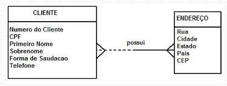

_Nota: ORMs são usados para explorar o domínio da aplicação com os envolvidos no projeto._

|Notações de Modelagem|
|---------------------|
|`EL` - modelagem de dados de negócio e lógica de alto nível|
| `Barker` - abrangente para todos os tipos de modelos de dados |
| `IDEF1X` - intencionada para modelagem física |
| `UML` - notação de modelagem não oficial |

**Etapas da Modelagem de Dados**:
1. Identificar os tipos de entidades.
    - descreve de forma coesa uma informação do mundo real.
    - Exemplo: entidade pessoa, localidade, profissão. 
2. Identificar atributos.
3. Aplicar convenções de nomes.
4. Identificar relacionamentos.
5. Associar chaves.
6. Normalizar para reduzir a redundância dos dados.
7. Diversificar para melhorar o desempenho.

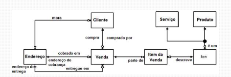

## MER e DER: Modelagem de Banco de Dados

**Modelo Entidade Relacionamento (MER)** - descreve os objetos (entidades) envolvidas em um domínio de negócio, com suas características (atributos) e como elas se relacionam entre si (relacionamentos).

**Classificação de Entidades**:
1. Fortes - independe de outras entidades.
2. Fracas - dependem de outros entidades para existir.
3. Associativas - surge quando há necessidade de associar uma entidade a um relacionamento existente.

**Relacionamentos**:
1. `1..1` - Cada uma das entidades envolvidas referenciam apenas uma unidade da outra.
2. `1..n` - Uma das entidades envolvidas pode referenciar várias unidades de outras, porém do outro lado, uma unidade só referencia uma outra entidade.
3. `n..n` - cada entidade de ambos os lados podem referenciar várias unidades.

**Atributos**: características que descrevem cada entidade dentro do domínio.
1. Descritivos - característica intrínseca de uma entidade.
2. Nominativos - define e identifica o objeto.
3. Referenciais (**Chave Estrangeira**) - ligação de entidade com outra.

Estrutura de um atributo - simples (único atributo define as caracteristicas da entidade); e composto (mais de um atributo para definir as informações)

No diagrama entidade relacionamento, as `entidades` são representadas por retângulos, os `atributos` por elipses e os `relacionamentos` por losangos, ligados a entidades por linhas, contendo a sua cardinalidade

|**Formas de Representação**|
|-----------------------|

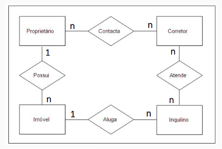

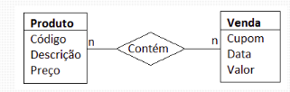

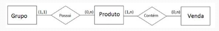

---

# 
Modelagem de Dados: Etapa Conceitual

_Node: modelos nada mais são do que abstrações do mundo real._
- representação simplificado de um problema.

São os atributos que caracterizam os elementos dentro de um conjunto.

## Terminologias

A relação na imagem abaixo representa o tipo `N:N`. 

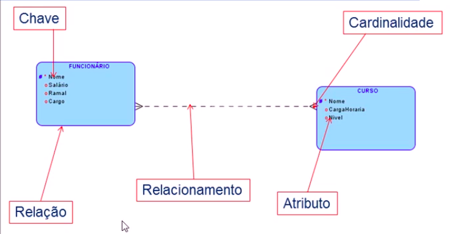

**Tipos de Chave**:
- Primária: valor que não se repete.
- Candidata: outro campo dentro da entidade que também não se repete.
- simples ou composta: quando uma chave possui 1 ou mais atributos para representação respectivamente.

A relação abaixa representa o tipo `N:N e 1:N`.

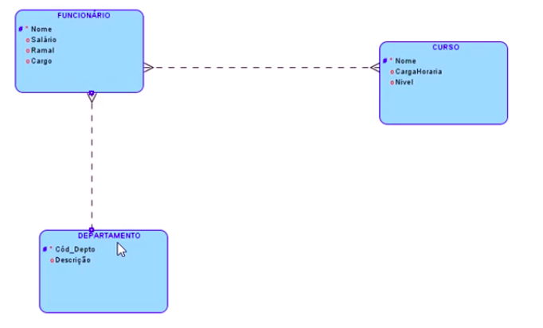

|Operações básicas|  |
|-----------------|--|
| **Seleção** | gera uma nova relação a partir de um subconjunto horizontal de outra |
| **Projeção** | gera uma nova relação a partir de um subconjunto vertical de outra |
| **União** | gera uma nova relação a partir da concatenação das tuplas de duas relações |
|           | A relação resultante não existe tuplas repetidas |
| **Diferença** | gera uma nova relação a partir das tuplas de uma relação ausente em outra |
|           | A relação resultante não existe tuplas repetidas |
| **Produto Cartesiano** | gera uma nova relação contendo a soma dos atributos e multiplicação das tuplas |

---

# 
Modelagem de Dados: Utilização de Operadores

| **Seleção** |
|-------------|

Aplica um filtro por linha

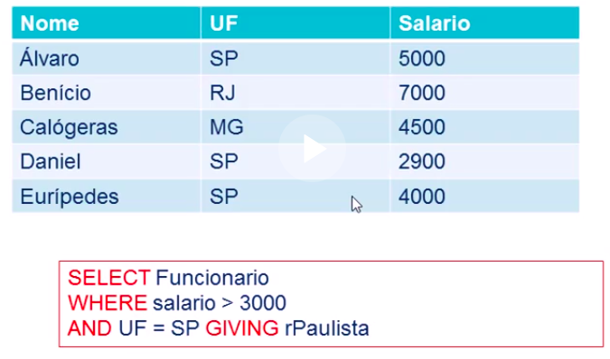

resultado:

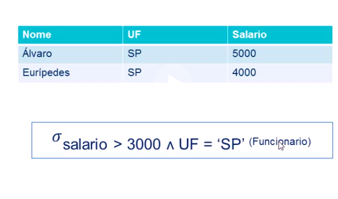

| **Projeção** |
|--------------|

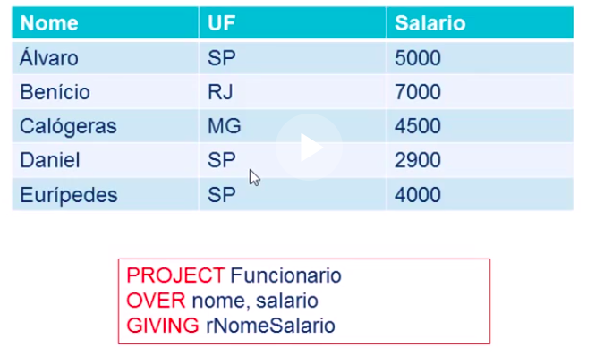

Resultado:

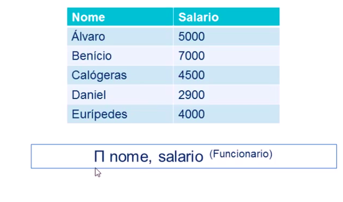

| **União** |
|-----------|

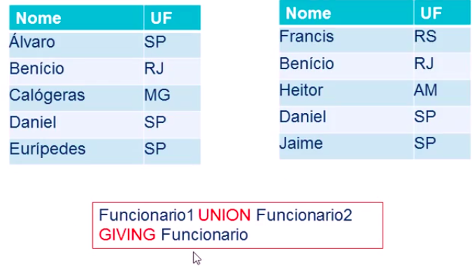

Resultado:

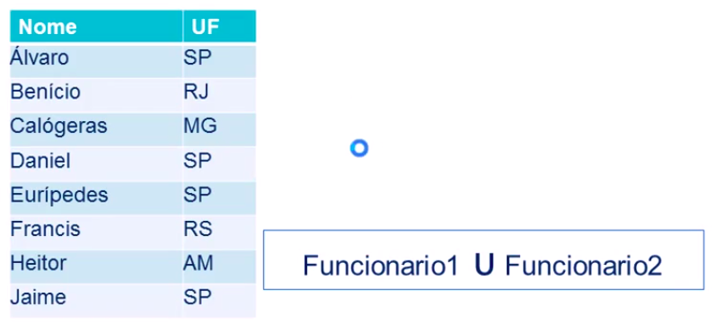

| **Diferença** |
|---------------|

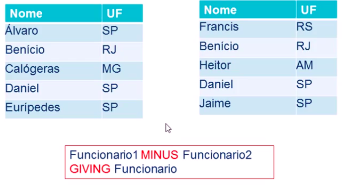

Resultado:

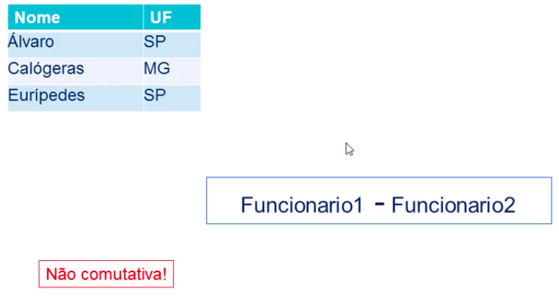

## Análise de Problema

`Entidades` - coleção de elementos compartilhando características em comum.

**Etapas de Análise**:
1. Identificar entidades.
2. procurar relacionar entidades.
3. Identificar atributos de entidades.
4. Identificar atributos de relacionamentos.

_Nota: o nome das entidades devem ser como substantivos._

`Atributos*` - quando o nome do atributo estiver no plural e com asterisco, 
significado que ele pode possuir outros valores.

**Tipos de atributos**:
- monovalorados: possuem apenas um valor.
    - Ex: `Fornecedor.CGC`
- compostos: representam uma estrutura; conjunto de sub-atributos.
    - Ex: `Fornecedor.Endereço` (logradoura, número, complemento).
- Multivalorador: reúnem vários valores.
    - Ex: `Fornecedor.Telefones`. Identificados pelo plural, mais o asterisco.

_Nota: o nome dos relacionamentos devem ser como verbos._

Quando todos os elementos de uma entidade estão presente no relacionamento, sua
contribuição é `total`. Caso contrário, o relacionamento será considerado `parcial`.

_Nota: O conceito de agregação surge na necessidade de diluir relacionamentos ternários._

---

# 
Modelagem de Dados: Chaves

Se houver outro atributo além da chave primária dentro da entidade que seja único, este pode ser chamado de chave alternativa

**Chave primária** - atributo que possui valor único dentro da entidade, normalmente utilizado para criar relacionamentos.

> OBS: se não houver um atributo com as características acima, é possível criar uma chave primária composta.

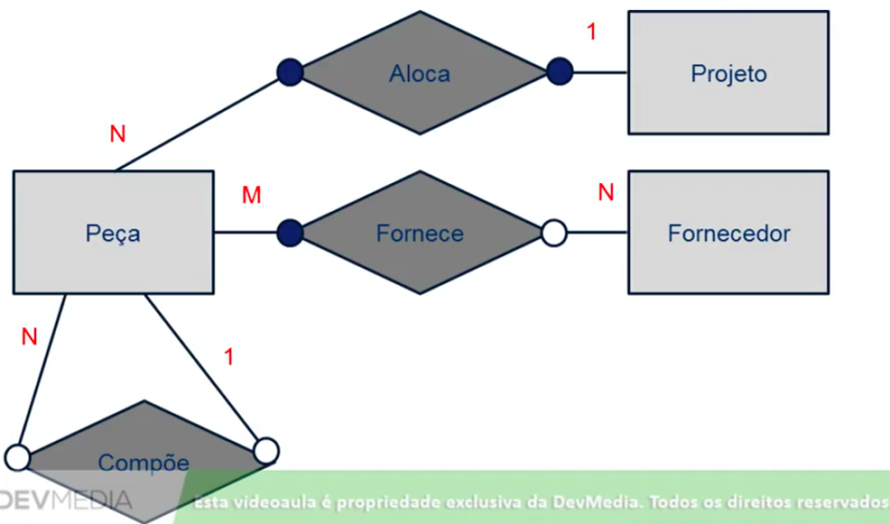

---

# 
Modelagem de Dados: M.E.R

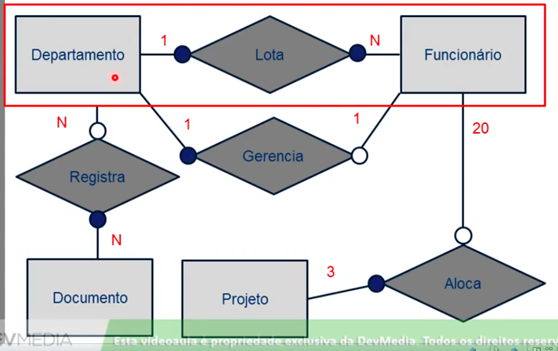

**Especialização de Entidades**: quando temos no conjunto de elementos caracteristicas comuns e específicos.

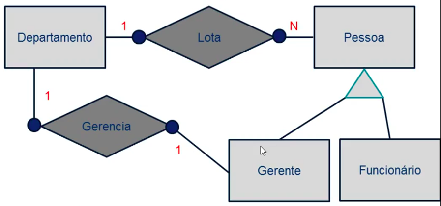

**Entidades fracas**: necessitam de outra entidade para existirem.
- Um exemplo disso seria uma entidade de dependentes que não poderia existir sem a entidade pai.
- conferem mais clareza ao modelo.
- representada por um retângulo de borda dupla.

_Nota: entidades = substantivos, atributos = adjetivos, relacionamentos = verbos; e atributos de relacionamentos = advérbios._

---

# 
Modelagem de Dados: Etapa Lógica

**Regras de Normalização**: reduz os riscos de integridade dos dados mitigando redundâncias.

_Nota: em um relacionamento `1:N`, a chave estrangeira deve ser inserida do lado N da relação._

**Normalização**: etapas utilizadas para detectar e corrigir possíveis redundâncias de dados.
- quanto mais normalizado um modelo, mais independentes entre si serão seus dados.

**Dependência funcional**: quando em um conjunto de atributos existir um atributo A1 dependendo de um atributo A2, de modo que
a cada valor de A1, temos valores diferentes de A2.

# 
Normalização e Anomalias

O processo deve ser aplicado para eliminar anomalias.

**Tipos de Anomalias**:
1. **Inserção** - dados não possuem independência.
2. **Atualização** - presença de redundâncias.
3. **Exclusão** - dados não podem ser excluídos, a não ser que outros sejam eliminados.

# 
Primeira Forma Normal

**Etapas**:
1. Identificação de chave primária.
2. Atributos estruturados.
3. Atributos Multivalorados.
4. Criação de Novas tabelas.

**1ª Forma Normal** - todos os atributos de uma relação são campos elementares.
- Todos os campos devem ser funcionalmente dependentes da relação, fora a chave primária.
- Na presença de atributo compostos, deve-se gerar uma nova tabela.
- Na presença de atributo multivalorados, deve-se gerar uma nova tabela.

| **Tabela Desnormalizada --> 1FN** |
|-----------------------------------|

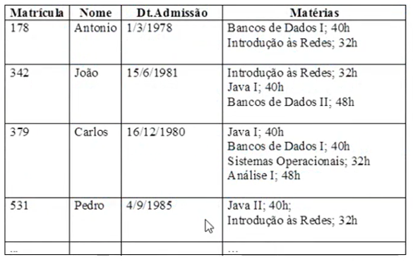

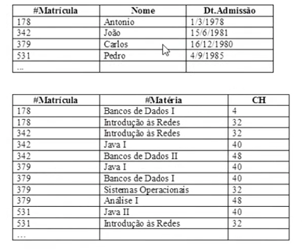

# 
Segunda Forma Normal

A relação tem todos os seus atributos, fora da chave primária, forem dependentes funcionais totais dela.
