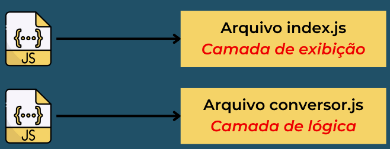
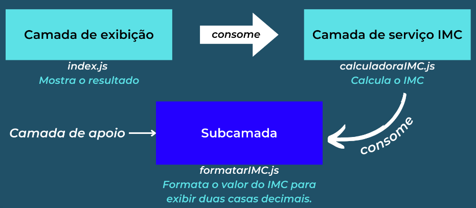

# <h1 style="font-size: 60px; text-align: center">JAVASCRIPT</h1>

# SUMÁRIO

1. <a href="#aplicacao-camadas-js">Javascript: Aplicação em Camadas</a>
2. <a href="#refatoracao-js">Javascript: Refatoração</a>
3. <a href="#contexto-aplicacao-js">Javascript: Contexto da Aplicação</a>
4. <a href="#hierarquia-camadas-js">Javascript: Hierarquia de Camadas</a>
5. <a href="#contextos-p2-js">Javascript: Contextos Parte 2</a>

# 
Javascript: Aplicação em Camadas

Código da aplicação está dividido em arquivos diferentes.

- facilita na manutenção do código.
- deixa o código mais organizado e fácil de entender.

O Tipo de camada pode ser determinado de acordo com o seu contexto.

# 
Javascript: Refatoração

_Nota: na programação, refatorar significa melhorar o código sem alterar sua funcionalidade._

Através dessa técnica podemos dividir o código em diversas camadas.

Dividir a aplicação em camadas é um processo de refatoração.

# 
Javascript: Contexto da Aplicação

Separação do conteúdo em grupos menores com base em suas semelhanças.

Contexto - conjunto de informações com um objetivo em comum.

Camadas:

1. serviço - executa a lógica central da aplicação.
2. validação.
3. exibição

_OBS: as comadas de validação e exibição podem ser modificadas de acordo com a necessidade do programador._

# 
Javascript: Hierarquia de Camadas

Subcamadas - camada de apoio que auxilia de forma direta ou indireta uma camada de hierarquia maior.

# 
Javascript: Contextos Parte 2

Recursos com contextos já existentes devem ser colocados em camadas existentes.
