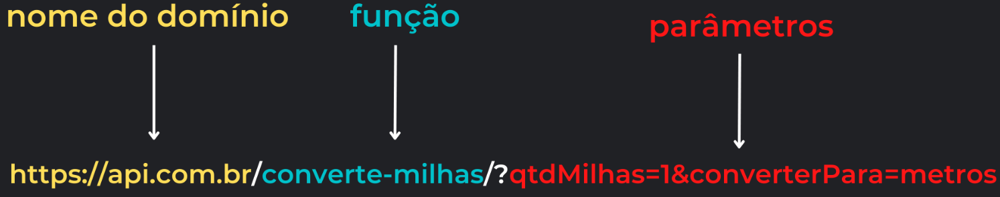
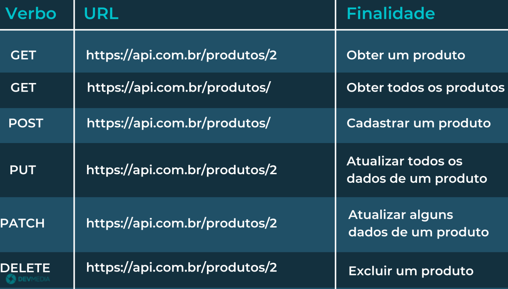
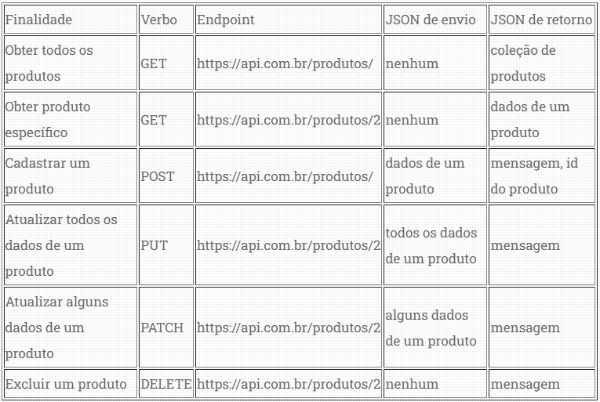
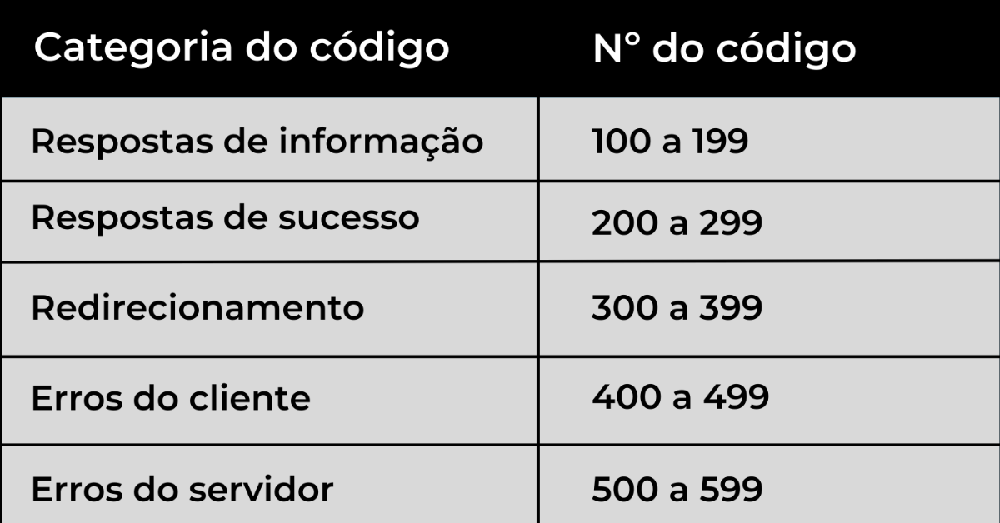
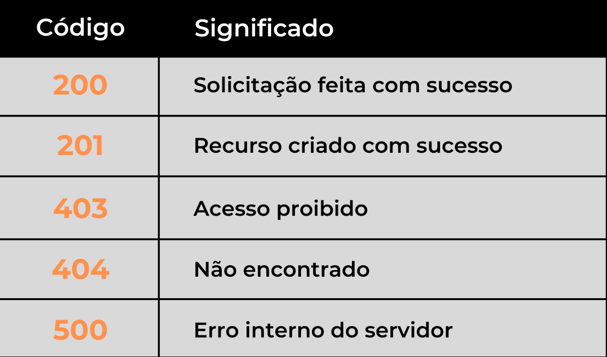
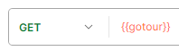
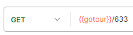
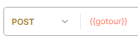
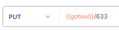
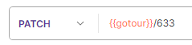

# Curso

# Sumário

1. <a href="#api">API</a>
2. <a href="#Nodejs-introducao">Node.js: Introducao</a>

# <p id="api">API</p>

API - Application Programming Interface.

- permitem a comunicação entre diferentes softwares.
- API recebe a requisição do fron-end, traduz e envia para a camada interna que processo
  os dados numa linguagem que o back end entenda.
  - normalmente os programadores front-end só devem se preocupar em consumir uma API
    para poder se comunicar com o back-end.

_Nota: integração de sistemas é uma forma de conectar sistemas para que trabalhem juntos._

## Padrão REST

Mais utilizada dentro do mercado, se comunicando com o front-end através da linguagem padrão REST.

- REST: define regras e padrões para comunicação entre front-end e a API RESTful.

Padrão REST:

1. Endpoints.
2. verbos HTTP.
3. JSON.
4. Códigos de Status.

## Endpoint

URLs que são disponibilizados pelo back-end para que o front possa acessar as funções
criadas no back-end.

Exemplo: Endpoint para funções.
`https://dominio.com.br/funcao/parametro`

- divisões:
  1. dominio: local onde API está hospedada.
  2. função: executada no backend.
  3. valor: valor usado no função.



Exemplo: Endpoint para manipulação de dados.
`https://dominio.com.br/dados/parametro`

- divisões:
  1. site.
  2. dados: coleção de dados que serão manipulada.
  3. valor.
- funcionalidade:
  1. cadastrar.
  2. alterar.
  3. consultar.
  4. excluir.

_OBS: normalmente o uso do parâmetro se dá com intuito de manipular um registro específico._

## Verbos HTTP

_Nota: o front-end pode enviar informações para back-end por meio de verbos HTTP e conteúdos JSON._

Formas de Consumir uma API com HTTP:

1. GET - obtem os dados.
2. POST - insere os dados.
3. PUT/PATCH - atualiza os dados.
   PUT - usado quando se deseja realizar uma atualização completa de informação, por exemplo, atualizar um produto.
   PATCH - usado quando se deseja atualizar um dado específico, por exemplo, o nome de um produto.
4. DELETE - exclui os dados.



## JSON

Normalmente é utilizado o formato de dados JSON no padrão REST.

Exemplo: sintaxe.

```
{
    "chave": "valor",
    "chave2": "valor2",
    ...
}
```

O formato JSON aceita 3 tipos de valores, que são: textos, valores numéricos e valores booleanos.



## Código de Status

Código enviado junto com a resposta que indica o status da requisição.

Categorias:


Significado de cada categoria:

- 100 a 199 (resposta de informação): solicitação em andamento.
- 200 a 299 (resposta de sucesso): operação bem sucedida.
- 300 a 399 (redirecionamento): solicitação recebida necessita de mais algumas ações do front-end.
- 400 a 499 (erro do cliente): erro vindo do front-end.
- 500 a 599 (erro no servidor): erro no back-end.

Principais códigos de status:


## Postman

Forma simplificada de enviar uma requisição e receber um retorno.

_Nota: todos os testes realizados abaixo fora feitos utilizando o endpoint:_ `http://devup.com.br/gotour/api/pacotes/`

Exemplo: colletion.


Exemplo: retornando pacotes.



Exemplo: retornando um pacote.



Exemplo: criando um pacote.



Exemplo: alterando um pacote.



Exemplo: atualizando um pacote.



Exemplo: deletando um pacote.


# <a id="Nodejs-introducao">Node.js: Introducao</a>

Plataforma server-side que permite criação de aplicações JS standalone, ou seja, que não depende de um navegador para a execução.

_Nota: npm é o gerenciador de dependências que já vem instalado junto com o node._
